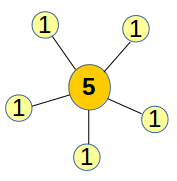
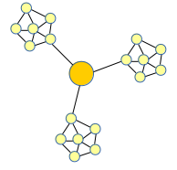
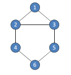
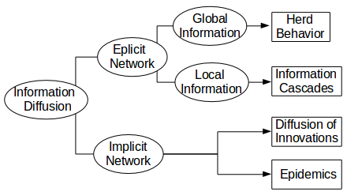

### Outline

- Social Network
- Centrality Analysis
- Community Detection
- <a href="#3">Link Prediction</a>
- <a href="#4">Label Prediction</a>
- <a href="#5">Information Diffusion</a>
- Role/Postion Analysis
- Social Relation Extraction
- <a href="#9">Cloud Computing</a>

<!--more-->

#### Journals

- Nature
- Science
- Physical Review
- Social Networks
- ACM Transactions on Knowledge Discovery from Data (TKDD)
- ACM Transactions on Intelligent Systems and Technology(TIST)
- ACM Transactions on Social Computing(TSC)
- IEEE Transactions on Knowledge and Data Engineering(TKDE)
- IEEE Transactions on Computational Social System

# Social Networks

|Sociocentric|Egocentric|
|根據整群分析|根據個人分析,向外延伸|

**Newman** 將 Network 分為四類:

- information Network  
  paper reference network  
  web hyperlink network  
  Language network
- Social Network  
  FB 好友關係
- Technology Network  
  電力系統(Power grid)
- Biologycal Network  
  蛋白質互動關係,食物鏈

為什麼要分這麼多類 Network?

> 因為要分析的重點不同,可能在 information Network 中很重要的,卻在 Social Network 可能不是那麼重要

#### Network Properties

1. small-world effect 六度分離理論[1967 Milgram]  
   平均透過 6 層關係可以連到任何你不認識的人

   補充資料：

   > [米爾格倫實驗 Milgram experiment 服從威權實驗](https://zh.wikipedia.org/wiki/%E7%B1%B3%E7%88%BE%E6%A0%BC%E5%80%AB%E5%AF%A6%E9%A9%97)

2. Transitivity  
   朋友的朋友很可能也是你朋友  
   [Clustering Coefficient](https://zh.wikipedia.org/wiki/%E9%9B%86%E8%81%9A%E7%B3%BB%E6%95%B0)  
   $ \frac{三角形數量}{任三點連線數} $
3. Degree distribution  
   Real world network :  
   Power law

   > P<sub>k</sub> = CK<sup>-&alpha;</sup>

   Heavy-tailed degree distribution  
   大量很低的數量,集合起來還是很驚人

4. Network resilience  
   如果拿掉一些點/邊,連通性會有什麼變化？  
   (e.g.有些人掛了,離職)  
   連接 path 的長度變長,或是 disconnect  
   廣告投放要投在哪個點影響力最大,如果是傳染病隔離哪個點最有效?
5. Mixing patterns  
   探討兩邊節點的 type,可能因為什麼關係成為朋友(職業/興趣/文化)
6. Degree Correlations  
   觀察兩個 degree 高或兩個 degree 低的點之間的關聯性
7. Community Structure  
   一個點和邊的密度很高的區域,稱作一個 community
8. Network motifs  
   在音樂上 motifs 是一種作曲法,靈感的意思  
    在生物基因上是一些重複的 pattern  
    在社群希望找到出現次數較高的 motifs(最常出現的 subgraph)

補充資料 : [Erdős Number](https://en.wikipedia.org/wiki/Erd%C5%91s_number)
<br>

# Centrality Analysis

- Centrality Measure 找到最重要的點(central)

  local

  > 1. Degree

  global

  > 2. Closeness

  3. Betweeness
  4. Eigenvector

- Group Centrality  
  找到一群最有影響力的人  
  在小世界理論中,如果送信到目標的前一步,都是經由特定的三個人,代表這三個人很重要

**Social actors(群眾的智慧)**

1. Connectors  
   認識很多人,很擅長社交
2. Mavens  
   資訊專家,知道很多各式訊息
3. Salesman  
   容易說服別人,擅長協調

**Social network 的四種 centrality**

**local**

1.  Degree centrality  
    若點的 degree 很高可能代表這個點很重要
    
    但 degree centrality 的缺點是如果有一個點的 degree 很低,
    但是這個點連接了多個 community,
    用 degree centrality 看不出這個點很重要

        

**global**

2. Betweeness Centrality  
   所有點 A 到點 B 的 shortest path 有幾條經過$$Node_i$$
3. Closeness Centrality  
   點 i 和所有點 j 的 shortest path 平均的距離
4. Eigenvector Centrality  
    這個點的重要性,透過看他朋友點的重要性  
   eigenvector
   > 一個向量乘上一個矩陣(transform),方向不變但 scale 可能會變  
   > Ax = $$\lambda$$x  
   > A 矩陣代表 social network 關係(1:朋友關係,0:不是朋友)  
   > x 代表重要性

**最短路徑演算法**  
unweighted graph

1. BFS
2. Floyd-Warshall

**Group centrality**

> 找出 social network 中幾個最有影響力的人  
> 或指定某幾個人觀察這些人的影響力

<hr>
<!-- 20170413  --> 
# Comunity Detection

**Properties of cohesion 凝聚力的判斷**

1. Mutuality of ties  
   所有 subgroup 彼此都有邊相連,在 graph 中就是完全圖的概念  
   e.g. clique
2. Closeness or reachability of subgroup members  
   不需要直接有邊相連,間接有相連就行了  
   e.g. N-clique,N-clan,N-club
3. Frquency of ties among members  
   Mutuality of ties 是說假設有 n 個人必須要和 n-1 個人相連,  
   那 Frquency of ties among members 只需要和 n-k 個人相連就可以了  
   是 Mutuality of ties 放寬版本  
   e.g. K-plex,K-core
4. Relative frequency of ties among subgroup members compared to non-member

**Clique**

> maximal complete subgraph,最大的子圖任兩點都有邊相連



- N-clique  
   在 grahp 中,任兩個點之間的距離<N  
   e.g. 2-cliques: {1,2,3,4,5},{2,3,4,5,6}
- N-clan  
   必須是 N-clique  
   在 subgraph 中,任兩個點之間的距離<N  
   e.g. 2-clan: {2,3,4,5,6}  
   (4->5 要經過 6,但只考慮 1,2,3,4,5 這個 subgraph)
- N-club  
   不必是 N-clique,但一定要是 subgraph of n-cliques  
   2-clubs: {1,2,3,4},{1,2,3,5},{2,3,4,5,6}
- K-plex  
   如果是 clique 每個點的 degree 是 n-1  
   如果是 k-plex,每個點的 degree 是 n-k  
   假設 subgraph 有 4 個點,2-plex 每個點的 degree 至少是 2
- K-core  
   至少和 k 個人是朋友
  每個點的 degree 至少是 k

**Community Detection Approaches**

- Partitioning
  - <a href="#KL"> Kernighan-Lin Alog(KL algorithm)</a>
- Hierarchical
  - <a href="#HC"> Hierarchical Clustering</a>
- Edge-Removal
  - <a href="#MM"> Modularity Maximization</a>
  - <a href="#BC"> Bridge-Cut Algo</a>

<h2 id="KL"> KL algorithm </h2> 
    Input  : weighted graph  
    Output : 切成兩個equal-size subgraph,且橫跨兩群的crossing edge的總和最小

**名詞定義**

- external cost  
   在 A 群中的點連到 B 群中的點(crossing edge)的 cost
- internal cost  
   在 A 群中的點連到在 A 群中的其他點的 cost
- difference  
   external cost - internal cost
- Gain  
   用來評估是否要交換的值,大於 0 代表兩點做交換後 crossing edge 的總和降低  
   例如 a,b 屬於不同群,ab 做交換  
   Gain = $$ D_a + D_b - 2\times W_{ab} $$  
   (Difference a + Difference b - 2 \* weighted $$\overline{ab}$$)
  Gain 公式推導：  
   若考慮 a,b 交換  
   old cost = $$ z + E_a + E_b - W_{ab} $$  
   new cost = $$ z + I_a + I_b + W_{ab} $$  
   old cost - new cost (Gain) = $$(E_a - I_a) + (E_b - I_b) - 2W_{ab} = D_a + D_b - 2\times W_{ab} $$
  > z (與 a,b 沒有連接的其他 crossing edge 總和)  
  >  E (external cost)  
  >  I (internal cost)

**步驟**

1. 任意切成兩半
2. 計算每一點的 difference
3. 計算每個邊的 gain
4. 從 gain 最大的開始做交換,交換後的點不再考慮(lock)
5. 交換到直到全部的點都被 lock 住
6. 挑 gain 總和最大的就是最終交換結果

交換數回合,若遇到 gain 是負的紀錄下來並繼續嘗試做交換,到最後再找 gain 最好的
交換完後的點就 lock 住不進入下一回合

**KL algorithm 複雜度**  
$$ O(n^2) $$ 找到最適合交換的兩點,有 n pair 要交換 &rArr; $$ O(n^3) $$

<!-- 20170413  -->

<!-- 20170512,20170621-->
<h2 id="HC">Hiraichiecal Clustering</h2>
bottom-up  
每一回合都找兩個最像的做合併  
* single link    
    距離取min  
* complete link  
    距離取max

#### Distance Matrix

1.  Approach1  
    計算 weights W$$_{ij}$$
    _ i 到 j 的路徑越多代表 i 和 j 關係越好  
     _ 只能找 non-overlapped paths \* 只要 i 到 j 的路徑都算(weighted by length)

        X$$_{ij}$$ = $$ \frac{1}{W_{ij}} $$

2.  Approach 2  
    如果 i 和 j 視同一群,那他們有相似的 behavior  
    behavoir  
     i 和 j 到 commuinty 其他點的平均距離相似
3.  Approach 3  
    $$ \frac{J(i,j)}{min(K_i,K_j)} $$  
    看兩個人共同朋友個數,共同朋友越多 J(i,j)越大

## Edge-removal Approach

> 不斷的拿掉邊(bridge edge),會出現越多的群數,直到符合要的群數

### GN algorithm

> 起始是一個 commuinity,每一回合拿掉 betweeness 最高的邊,並重新計算每個邊的 betweeness,並持續到出現想要分到的群數  
> 這裡的 betweeness 是以邊考量,不是用點。考慮任兩點的最短距離有幾條會通過$edge_i$

**不同方法計算邊的 betweeness**

1. shortest path  
   任兩點最短路徑有多少條會經過邊
2. Random-walk
   計算 a 會走到 b 的機率  
   a 走到 b 會經過邊 v 的機率
3. Current-flow
   引進電路學概念的計算方法

缺點

1. 計算最短路徑耗時
   O($m^2n$)

```
    m   edge
    mn  betweeness
```

2. 什麼時候停?  
   什麼時候是最佳的分割

## Modularity

Modularity measure:

> how good a particular partition forms a community.  
> 評估 community 切分的好不好

$ Q = \frac{1}{2m}\sum_{ij}{(A_{ij}-\frac{k_ik_j}{2m})\delta_{ij}}$

> m : # of edges  
> $A_{ij} = 1$ 如果 i,j 點之間有邊,沒有邊$A_{ij}= 0$  
> $k_i$ : degree of $node_i$  
> $\delta_{ij} = 1 如果i,j屬於同一個community,否則為0$  
> Q : 分群的分數

Q = 0 no community  
Q ~ 1 prefect cut

#### Newman Fast Alogorithm

利用 hireachcal 合併,並每個步驟算 modurity,並找出最高的 Q 做切分

<h2 id="BC"> Bridge cut </h2>

**Clustering coeffiecient**

> 觀察 v 的鄰居的朋友關係,例如 v 有 4 個朋友,那 4 個人最多有 6 個關係,算關係的比例,實際上有關係/最多有幾個關係

$ C_v = \frac{2\|\cup_{i,j \in N(v)}e(i,j)\|}{d(v)(d(v)-1)} $

> N(v) : 和 v 直接相連的點  
> d(v) : 點 v 的 degree  
> e(i,j) = 1 如果 ij 有邊相連,否則=0

**Bridge Centrality**  
 rank of betweenness centrality \* rank of bridging coeffiecient  
 如果只考慮 betweeness(global)會有一些情況不太好  
 加入 bridge centrality 可以考慮到 local 的特質

**Community Search**  
 給一個 social network,並給一些 query(其中幾個人),  
 given grahp G, a set of query node  
 goal: find a densely subgraph of G, and contains the query nodes

**Induced Subgraph**  
xy edge 在 G 中,xy edge 也要在 induce subgraph 中

**goodness function**

1. edge degree
   時間複雜度太大
2. average degree
3. minumin degree
   這群人認識最少的人,讓這個人的值變大
   induced subgraph 的 degree  
   容易受到 outlier 影響

**Constrain**  
distance constrain  
限制邀請來的人的最長距離

**Monotone Function**

- monotone increaing
- monotone decresing
- non-monotone

---
 
<H1 id="3">Link Prediction </H1> 
<a href="#LP">Link Prediction</a> 

<a href="#NSBM">Node-wise Similarity Based Methods</a>

<a href="#TPBM">Topological Pattern Based Methods</a>

<a href="#PMBM">Probabilistic Model Based Methods</a>

## Link Prediction

**Goal**

1. Predict the existence of links
2. Predict the type of links

**Strategies of Prediction**

1. Knowledge-driven strategy  
   專家系統(領域專家提供 rule)
2. Data-driven approach

**Link Prediction Problems**

1. Link existence prediction  
   邊是否存在或是隨著時間變化,邊會有什麼變化
2. Link classification  
   關係的總類
3. Link regression  
   最重要的邊是哪一個

**Application**

1. Web hyperlink creation
2. Collaborative filitering
3. Information retrieval
4. Clustering
5. Record linkage

<h2 id="NSBM"> Node-wise Similarity Based Method</h2>    

> 計算兩個點的相似度,如果兩個點很相似他們可能就有link  
e.g. Similarity between words  
觀察word的前後文字來判斷相似程度

**Learning-Based Similarity Measure**

- Binary Classification Approach
  - Decision Tree
- Regression-based Approach(迴歸)  
   e.g linear regression  
   $$ Y = \alpha + \beta_1X_1 + \beta_2X_2 + ... + \beta_nX_n $$  
   利用學習方式估計出$$ \alpha , \beta  $$

<h2 id="TPBM"> Topological Pattern Based Methods </h2> 
> 計算兩點之間的分數,若大於某個值就表示他們之間有關係(連線)

- **Local Method**

  - Common Neighbors(CN)  
     計算$node_x$和$node_y$的共同鄰居
  - Salton Index  
     類似 cosine similiary
  - Jaccard Coefficient(JC)

    > 交集/聯集

    $\frac{node_x和node_y的共同鄰居}{node_x的鄰居和node_y的鄰居做聯集}$

  - Leicht-Holme-Newman Index(LHN)
  - Hub Promoted Index(HPI)  
     Hub 概念像是入口網站,類似目錄連到很多子分支
  - Hub Depres Index(HDI)
  - Adamic/Adar(AA)  
     看共同鄰居的鄰居數量取 log 和倒數加總
    $Score(x,y) = \sum_{z \in N(x) \cap N(y)} \frac{1}{log|N(z)|}$
  - Resource Allocation Index(RA)  
     和 AA 差在分母沒有取 log
  - Preferential Attachment  
     $node_x的鄰居\times node_y$鄰居

- **global Method**
  - katz  
     計算所有$node_x到node_y$距離是 1,2,3..n 的 path 有幾條,乘上一個參數$\beta$做加總
  - Hitting Time  
     x 走到 y,做 random work 的期望值作為比較條件
  - PageRank
  - SimRank

<h2 id="PMBM"> Probabilistic Model Based Methods </h2> 

relational Markov model  

<hr>

####Labeld Social Network </h1> 
#### Type of Labels  
1. Binary
2. Numeric  
3. Categorical
4. Free-text

#### Goal

給一個 network 且只有部份點有 labeled,用已知的 label 來預測未知的 label

1. Predict the type of nodes
2. Predict the attribute values of nodes

#### Label Prediction

> 根據已知的 label 預測未知點的 label

#### Different setup for label prediction

1. Inference vs. Learning  
   Inference(unsupervised)  
   Learning(supervised)
2. Disjoint vs. Collective  
   Disjoint : 沒有標籤的點就不考慮  
   Collective : 沒有標籤的點也會放進去考慮
3. Across-network vs. within-network learning  
   Across-network 拿一個 social network model 去預測另一個 social network  
   within-network 拿全部資料做的 model 來做預測

#### Node Label Prediction

- <a href="#RNC">Relational Neighbor Classifier</a>
- <a href="#GE">Ghost Edge</a>
- <a href="#RMN">Relational Markov Network</a>
- <a href="#PEM">Pseudolikelihood EM </a>

<h2 id="RNC"> Relational Neighbor Classifier </h2> 

> 看鄰居多數是什麼就判斷node是什麼

- 問題：  
   如果已知的點很少,unknown 的很多(Sparse label),若只用一個點判斷另一個點就沒那麼可靠
- 解決：
Iterative Relation Neighbor classifier  
 判斷分為好幾回合,若多數點是 unknown 那就判斷是 unknown  
 unknown 也視為一種 label

<h2 id="GE">Ghost Edges for Node Label Prediction</h2>   
將沒有label的node用Ghost edge連到有label的node,有label的node就算沒有實體的edge連到unlabel node但是也可以造成影響。且影響力可以依據距離來做調整。

#### Steady-state Probability

- Markov Process  
   e.g. 城市和郊區遷移問題

#### Random walk with Restart

概念有點類似 Markov Process,使用 Adjacency matrix A 表示 network,有一個初始的起點$\vec{V_q}$,並且有一個 Restart 的機率 c 每一回合有機率回到起點。利用 random walk 在圖上移動到穩定,並利用來判斷每個點對某一點的影響力,在對這些影響力做等級劃分,依照機率分為 ABCDEF...等級

Steady-state vector : $ \vec{U_q} = (1-c)A \vec{U_q}+c \vec{V_q}$  
Initial state : $\vec{U_q} = \vec{V_q}$

**Two Classifers**

1. GhostEdgeNL
2. GhostEdgeL  
   Logistic regression

<hr>
<h1 id="5">Information Diffusion</h1>   
> 想知道消息/能量/疾病/..的擴散方向,透過什麼方式擴散,可以擴散到哪等等問題

**three elements of diffusion process**

1. Senders 散佈者
2. Receivers 接收者
3. Medium(channel) 中間人

**Types of Information Diffusion**

- Herd behavior(global information)  
   群眾行為,大多數人怎麼做,就有可能會跟著做
- Information cascades(local information)  
   FB 朋友互相的轉發貼文
- Diffusion of innovation  
   沒有明確的網路圖形,透過電視廣告,從朋友聽說等等的傳遞方式
- Eqidemics
  疫情擴散



## Herd 從眾

> 有一群人做決策,大家會趨向一個方向

**Herd example**

1. Soloman Asch Experiment  
   左邊一個長條圖形和右邊有三個不同長短的長條圖形,比較長度和哪個最相近

2. Urn Experiment (Bayesian Modeling of Herd Behavior)  
   有多個學生來猜測甕裡面主要是放什麼顏色的珠寶  
   甕裡面珠寶有紅色和藍色,不會是全部是藍色或全部是紅色  
   每個學生從甕中抓一把,根據自己手中的內容和黑板上紀錄結果做預測  
   並將預測結果寫在黑板上,後面的同學可以參考  
   那可能抽到大多數是藍色,但黑板上紀錄大多是紅色,可能會影響你的猜測

## Information Cascade

**Diffusion Models**

1. Descriptive models  
   機率模型
2. Operational models  
   一步一步的動態模擬擴散  
   每個點可以是 Active 或 Inactive  
   假設:  
   每個 node 可以從 inactive 轉成 active 但不能從 active 轉成 inactive  
   e.g.

   - Linear Threshold Model
   - Independent Cascade Model

   **Linear Threshold Model**  
   每個人都會有一個 threshold 代表會變成 active 門檻值  
   每個邊上會有影響力的值(可以是單向或雙向)  
   如果你的鄰居加總的影響力大於你本身的 threshold 那你也會變成 active  
   由 Senders 開始一步一步的擴散

   **Independent Cascade Model**  
   每一個人只能影響鄰居一次,失敗了不能再影響一次  
   邊上權重是影響成功的機率

## Influence Maximization Problem

給一些起始的 senders 觀察最後有哪些人被影響  
給 k 個 senders 並且找出這 k 個 senders 是誰且最後影響的人數最多  
(應用: 廣告要放在哪裡)  
Constrained optimization problem

問題難度: NP-hard  
證明這個問題的難度:  
 符合 Submodular Function,且要在所有 node 中找出 k 個,使得 f(k)為 maximized  
 已經被證明為 NP-hard 問題

**Submodular Function**

- Non-negative
- Monotone
- Submodular 邊際效應遞減
  > f(a,b,v) - f(a,b) > f(a,b,c,v) - f(a,b,c)
      原來有a,b加入v所增加的量大於原來有a,b,c加入v所增加的量
      例如原本能考60分,讀一天可以考到80分,
      和原來能考90分,可是讀一天只能考到95分

遇到 NP-hard 問題考慮的解法

- Approximation Approach
- 平行運算

**Approximation Approach**  
Greedy algorithm  
每回合找出 Submodular 最大的作為 sender

## Outbreak Detection

> 能不能透過放 sensor 提早知道消息的擴散

給一個 network G(V,E),找到 placement A(sensor)  
goal : to max R(A)  
R(A) : reward  
c(A) : cost

**placement objective**

- detection likelihood  
   希望所有事件都偵測到
- detection time  
   多久偵測到
- Population affected  
   已經擴散多少,多少人知道

**Approached of Outbreak Detection**

1. Heuristic in simple case
   each node has equal cost  
   每次都加入一個 sensor,那計算每一個 node 加入的邊際效應  
   並選最大的邊際效應加入
2. Heuristic in more complex case  
   多考慮 cost,所以算法變成每次加入最大的 benifit/cost

## Team Formation in Social Networks

> 如何要找到正確的人,組成一個團隊

- Task
- Expert
- Network
- Effective

Given

> set of n individuals , a graph , a task

Find

> 必須包含 task,individuals skill 聯集要包含 task

    communication cost要最小越好

**Communication Cost**  
Diameter

- distance : shortest path (geodesic distance)
- eccentricity : 其中一個點到其他所有點的 shortest path,並取最大的值
- radius : minimun eccentrictity 溝通成本最低
- diameter : maximun eccentrictity 溝通成本最高

measure communication cost

1. diameter
2. minimum spanning tree

不管用 diameter 或是 MST 都是 NP-hard  
那縮小範圍可以考慮到加入限制 :  
$$ \quad $$人數越少越好 &rarr; set cover problem(NP-complete)

作者提出的方法將 set cover problem 視為 baseline 作為比較  
NPC 問題通常找近似解,所以需要一個比較的方法

1. RarestFirst Algo for Diameter-TF  
   先從 skill 少的加入集合考慮,必找 diameter 低的持續加入集合  
   假設 skill 少的同時有 2 個人會,那要挑誰？
   1. 隨便挑
   2. 從欠缺能力看,計算和有欠缺技能的 node 計算 diameter,挑 minimun diameter
2. The Enhanced Steiner ALog. for MST-TF  
   The Minimum Stener Tree Problem (NP-hard)  
   給入 require 的點,必找出含有這些點的 tree  
   如果 require 是所有的點,問題就會變成 minimal spanning tree,  
   minimal spanning tree 是 minimum stener tree 的 speical case  
   如果 require 只有兩個點,那就會變成 shortest path 的問題

將每一個 skill,各至成為一個 node,且連到擁有這些技能的點,  
 將題目轉為 stener alog,require 就是自己建立的 node,找到後再去除這些 node  
 1.從自己建立的 node 找一個點放到 set 中  
 2.計算和 require 和 set 中的距離,取最短,並將 path 上的點加入 set,直到所有 require 都在 set 中

<!-- 20170512 -->

<!-- class -->

Epidemics
疫情會有一個週期
接觸後有多少機率會傳染 p

一個人有傳染並，那他會傳染給多少的人

Basic reproductive number $R_0$

$R_0 < 1$ 疫情會在一段時間內消失
$R_0 > 1$ 疫情會持續下去

目標將低 k 或是 p

Epidemics modeling

- Statistics models
- Agent-based models
- network models

Statistics model
SIR model

- Susceptible
- Infectious
  被感染
- Removed
  病情痊癒

參數

1. p 病情的傳染機率
2. $t_i$ 病情的持續時間

<h1 id="9">Cloud computing</h1>

* <a href="#9_1">MapReduce</a>
* <a href="#9_2">Pig Programming</a>

[The NIST Definition of Cloud Computing](http://nvlpubs.nist.gov/nistpubs/Legacy/SP/nistspecialpublication800-145.pdf)

- Parallel
- Distribute
- Grid
- Utility Computing

#### Parallel Computing

> 將大問題拆成小問題且同時執行

#### Distributed Computing

> 多台獨立電腦透過網路連結且為同一個任務工作

#### Grid Computing

> 是一種 Distributed Computing

#### Utility Computing

> 讓計算像使用電力,水等資源,只要有一個 client 端就可以使用,不在本地端計算,而是在提供服務的地方計算

#### Performance Optimization

- Parallel Computing
- Job Scheduling
- Load Balancing

#### Survice Models

1.  IaaS(Infrastructure as a Service)

    > 包含硬體,OS,driver,networking  
    > 使用者不用管理或控制底層的東西

        Virtualization:
        Abstraction of logical resource away from underlying phyical resources
        Improve utilization,security

2.  Paas(Platform as a Service)

    > 提供工程師一個寫程式的環境,包含程式語言和工具,且不用管理底層的硬體但可以做控制

        e.g. Programming IDE,Programming API,System Control interface,Hadoop,Google App Engine,Microsoft Windows Azure

3.  SaaS(Software as a Service)

    > 提供應用程式給一般人使用,透過 clinet 界面就可以使用

        e.g. web Service,Google App

<!-- 20170525 -->

<!-- class -->
<h1 id="9_1">MapReduce</h1>

- A programming model

local aggregation
map 跑完的結果先處理(先加起來)
可以提升效能,在 sort and shuffle 可以減少計算

3 approahes

- Combiner
- Improved Word Count
<!-- class -->

<!-- class -->

relational database 如何做 join
透過主鍵連結兩張表,map 做的事就是找到對應的 key 和 value
key 就設為主鍵,但 value 必須要有紀錄資料和資料來自哪張 table
在 reduce 時才不會出錯

MapReduce Algorithm Design
提供紀錄中間狀態,提供需要 for loop 的程式執行
可以自己設定 key

<!-- class -->

<!-- class -->

介紹 dijkstra
那要怎麼把 dijkstra 做成 mapreduce 版本
dijkstra 每一回合都要找到最小 cost 當成下一點
繼續遞迴的以 cost 最小的展開下去

mapreduce 可以找到 local 的最小值
但不能找到 global 的最小值
mapreduce 沒有提供 share memory 的機制去交換 global 的資料

先考慮 unweight shortest path
每個 edge 都看成是 1
那目標就變成找到最少的 edge 數

那就可以利用 BFS 解決這個問題

要將 dijksta 的問題改成 mapreduce 版本就要利用這個概念

平行 shortest path algorithm

- brute force approach
- all edge have unit distance
- Parallel BFS
  - iterative algorithm
  - 每次的結果存到 disk,下次再讀取,但會有 disk IO 問題

通常在 mapreduce 中的資料結構是以 linklist 的形式儲存
如果是 sparse 的矩陣會儲存太多的 0,在 map 時會紀錄太多 0
所以利用 linklist 來儲存,有值才紀錄
且對 sort and shuffle 的步驟負擔會比較小

每一的 mapreduce 會做一個 hop(層),
且每回合的結果要寫回 disk 供下一回合使用

Inverted Files
利用 linklist 紀錄每個 term 出現在哪些文章中

<!-- class -->

<!-- 20170602 -->
<h1 id="9_2">Pig Programming</h1>

- sql-like language, 透過 hadoop 處理大量半結構化資料
- hadoop sub-project
- data flow language
- higher-level language

收到 user query 後，pig 會將 query 轉換成 logical plan 並在過程中做最佳化,logical plan 之後產生 physical plan(存取記憶體等操作),physical plan 最後轉換成 map reduce plan

**lazy execution**

> 直到執行 request output(store/dump)才開始執行程式

好處

- in memory pipelining  
   將執行完的結果直接傳給下個指令使用,不需要存到 disk 再去讀取
- filter re-ordering across multiple commands  
   可能先做 filter 再開始處理 join 等等的指令,可以減少計算的複雜度(指令的最佳化)

**data type**

- int
- long
- float
- double
- chararray
- bytearray

**指令**

- load  
   load 'user.txt';
- store
  store result into 'output'
- dump
- filter  
   filter User by age > 18 and age <= 25
- join
  - outer join (right / left)  
     filter 後濾掉的資料也會出現,以 right 或 left 為主
- group  
   group user_url by url  
   將欄位一樣的合併在一起  
   pig 允許 complex data type(一個欄位有多筆資料)  
   在 relational database 不允許有一個欄位有多個值的情況
- cogroup  
   cogroup Users by userId, Urls by user;  
   可以針對多個資料表做 group
- foreach  
   foreach urlgroup generate group as url,  
   count(user_url) as count,
- order  
   ASC,DESC
- flatten
- distinct  
   將重複的濾掉

**eval function(aggregation function)**

- count
- sum
- avg
- min/max
- size
- concat
- tokenize
- diff

example  
Word Count using Pig

- Load file
- generate token 做斷詞
- group each word
- count word
- save file

<!-- 20170602 -->

<!----------------------------------- class --------------------------------------------->

#### Agent-based Model

代理人做事的程式
例如高鐵程式搶票.搜尋引擎

#### Agent

- 獨立單位沒有辦法分割
- 自動做事情
- 自我決定事情
- 在不同時間上有不同的狀態

#### agent base 如何模擬疫情擴散

FluTE
national-level simulation model
人口資料/通勤資料/旅行資料

population structure

- discete-time stochastic simulation
- five age groups 0-4,5-18,19-29,30-64,64+ years
- 家庭人口數
- 每個人屬於什麼 group,每個人有多個身份

#### social network 隱私問題

- identity disclosure 去識別化
  e.g. 將姓名,身份證號碼去掉

去識別化後還是會有問題
如果去識別化後的點只有一個點 degree 是 100
我剛好又知道 A 的朋友也是 100 個,那我可能會猜這個點是 A

Privacy model
k-degree anonymity
概念是造幾個假的資料，讓相同 degree 的點被猜出的機率下降
在降低被猜出的機率同時要注意不要修改到太多原始資料
將相同 degree 點的個數至少有 k 個

Problem define
在點數相同的情形下,只修改邊,使相同 degree 的點個數至少有 k 個
且前後 graph 的差異最小

GraphAnonymization algorithm
Degree-sequence anonymization
將每個點的 degree 由大排到小

<!----------------------------------- class --------------------------------------------->

<!----------------------------------- class --------------------------------------------->

# Networks with Signed Edges

<!----------------------------------- class --------------------------------------------->
