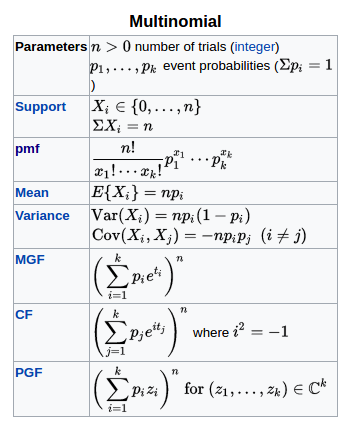
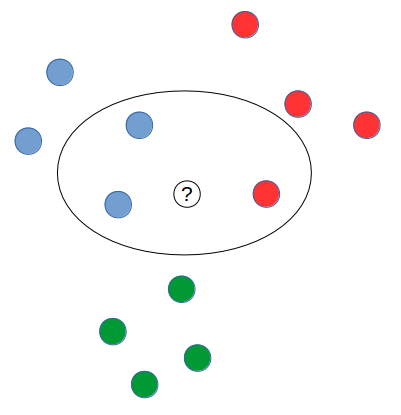
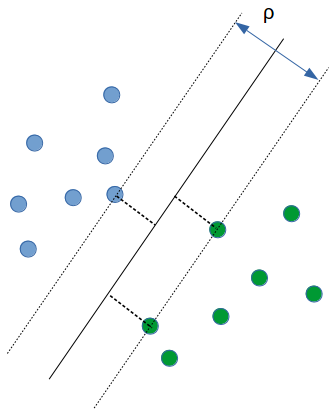
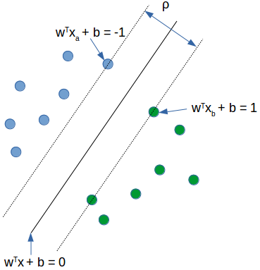

<hr>

課本: [Introduction to Information Retrieval](https://nlp.stanford.edu/IR-book)

<hr>

# CH8 Evaluation in information retrival

評量 search engine 好壞

1. 搜到的 index
2. 搜尋速度
3. 二氧化碳排放量
4. 和搜尋相關程度

相關程度

1. benchmark 資料集
2. benchmark queries(問句)
3. 文章是否相關的標記(ground truths)

queries 和 information need 有落差
想找的東西,不會下 key word

**Precision (P)**

> Precision = $$\frac{檢索到相關物件的數量}{物件總數}$$

**Recall (R)**

> Recall = $$\frac{檢索到相關物件的數量}{相關物件總數}$$

|               | Relevant            | Nonrelevent        |
| ------------- | ------------------- | ------------------ |
| Retrieved     | true positive(tp)   | false positive(fp) |
| Not retrieved | false negatives(fn) | true negatives(tn) |

true positive(tp) 機器判斷+且為真  
false positive(fp)機器判斷+但是是假  
false negatives(fn) 機器判斷-但判斷錯  
true negatives(tn) 機器判斷-且判斷對

P = $$\frac{tp}{tp+fp}$$

R = $$\frac{tp}{tp+fn}$$

**Accuracy vs Precision**  
accuracy = $$\frac{tp+tn}{tp+fp+fn+tn}$$

> accuracy 不適合用在 information retrieval,
> 因為通常 Nonrelevant 會非常的大,tn 項非常大除分母 fn 和 tn 都非常大結果會趨近於 1,所以才用 Precision 和 Recall 作為依據

**調和平均數(harmonic mean)**

> H = $$\frac{n}{\frac{1}{x_1}+\frac{1}{x_2}+..+\frac{1}{x_n}}$$

Precision/Recall Tradoff
使用調和平均數計算 Precision 和 Recall 的 Tradoff  
量測的數值稱做 F measure,&alpha;和 1-&alpha;分別為 P 和 R 的權重,一般是取&alpha;=0.5  
(P 和 R 重要程度相同)

> F = $$\frac{1}{\alpha\frac{1}{P}+(1-\alpha)\frac{1}{R}} = \frac{(\beta^2+1)PR}{\beta^2P+R}$$ where $$\ \beta^2=\frac{1-\alpha}{\alpha}$$

#### Ranked Evalution

P,R,F 都是 unordered(沒有等級)  
一個 query 會有一個 Precision/Recall 圖  
使用內插法(interpolated)可以得到一張較平滑的 P-R 圖  
(和機器學習 ROC curve 相似)  
P-R curve 的面積越大效能越佳(代表 Precision 掉越慢)

**內插法**

> $$\ p_{interp}= \max\limits_{r'\ge r}\ p(r{'})$$

r 代表 recall,
作法是從目前往後找最高的點向前填平,並重新畫 P-R 圖

**Mean Average Precision(MAP)**

> $$\ MAP(Q) = \frac{1}{|Q|}\sum^{|Q|}_{j=1}\frac{1}{m_j}\sum_{k=1}^{m_j}Precision(R_{jk})$$

第一個 sum 算 query 平均  
第二個 sum 算 precision 平均

**Precision at k**  
第 k 個搜索結果的 Precision

**R-Precision**  
文件中總共有 R 篇相關文章,以 R 作為 cut-off,計算 Precision  
e.g. 總共有 100 篇文章,其中 10 篇是相關的  
且搜尋結果是:RNRNN RRNNN RNNRR ....  
R=10(只看 RNRNN RRNNN)計算 Precision  
R-Precision = 0.4

**Normalized Discounted Cumulative Gain(NDCG)**  
作者：Kalervo Jarvelin, Jaana Kekalainen(2002)

> 用來衡量 ranking quality

e.g.  
G = <3,2,3,0,0,1,2,2,3,0,...>  
G 表示一個搜索的結果(3 高度相關, 0 沒關係)  
步驟:

1. Cumulative Gain(CG)

   >

   $$
   CG[i] = \left\{\begin{matrix}
   G[1], &if\ i=1 \\
   CG[i-1]+G[i], &otherwise
   \end{matrix}\right.
   $$

   目前項+＝前一項(做成一個遞增的函數)
   CG'=<3,5,8,8,8,9,11,13,16,16,...>

2. Discounted Cumulative Gain(DCG)

   >

   $$
   DCG[i]=\left\{\begin{matrix}
   G[i], & if\ i=1\\
   DCG[i-1]+G[i]/log_b\ i, & otherwise
   \end{matrix}\right.
   $$

   DCG'=<3,5,6.89,6.89,6.89,7.28,7.99,8.66,9.61,9.61,...> if b=2
   i 代表排名,對排名做懲罰(除 log<sub>2</sub> i),排名越後面懲罰越重
   代表如果搜尋的結果很差,和理想的排序分數會相差很多

3. Normalized Discounted Cumulative Gain(NDCG)  
   理想的搜索結果 I=<3,3,3,2,2,2,1,1,1,1,0,0,0,...>(高度相關的排越前面)  
   理想搜索結果 DCGI=<3,6,7.89,8.89,9.75,10.52,10.88,11.21,...>  
   nDCG<sub>n</sub> = $$\ \frac{DCG_{n}}{IDCG_{n}}(\frac{相關程度排序}{理想相關程度},做正規化)$$  
   NDCG=<1,0.83,0.87,0.77,0.70,0.69,0.73,0.77,...>

**benchmark 資料集**

1. Cranfield
2. TREC(nist.gov)  
   Ad-hoc 資料集(1992-1999)
3. GOV2
   2500 萬篇文章
4. NICIR
   cross-language IR
5. Cross Language Evaluation
6. REUTERS

**標記資料準則**  
Kappa measure

> 標記資料是否一致的衡量標準,若標記不一致資料中就沒有 truth

Kappa 計算公式

> $$\ \kappa = \frac{P(A)-P(E)}{1-P(E)}$$

**搜尋結果的呈現 Result Summaries**

- 搜尋結果呈現：10 blue link
- 搜尋結果下方文字說明分為 Static 和 Dynamic
  Static:固定抽前 50 個字
  Dynamic:利用 nlp 技術,根據搜索關鍵字動態做變化
- quicklinks  
  底下多的連結

<hr>

# CH6 Model

- Vector Space Model
- Probabilistic Information Retrieval

|Empirical IR | Model-based IR|
|暴力法|有理論模型|
|heuristic|數學假設|
|難推廣到其他問題|容易推廣到其他問題|

**IR model 歷史**

- 1960  
   第一個機率模型
- 1970  
   vector space model(75)  
   classic probabilistic model(76)
- 1980  
   non-class logic model(86)
- 1990  
   TREC benchmark  
   BM25/Okapi(94)  
   google 成立(96)  
   Language model(98)
- 2000  
   Axiomatic model(04)  
   Markov Random Field(05)  
   Learning to rank(05)

**Vector space**

|Vocabulary|V = { $$ w_1,w_2,w_3,...w_v $$ }|
|Query|q =$$ \{q_1,q_2,...,q_m\} $$|
|Document 文章|$$  {d_i} = \{  w_1,w_2,...  \} $$|  
|Collection 文章集合|C = { $$ d_1,d_2,d_3,... $$ }|  
|R(q) query 的集合|R(q) &sub; C|

**目標是找到近似 query 的集合**  
策略:

1. Document select  
   挑文件如果是相關就收到集合  
   absolute relevance(系統必須決定是相關還是不相關)
2. Document ranking  
   query 的結果>threshold 就收進去  
   relative relevance(不必是 1 或 0,相近到一定程度就收進集合)

**Probability Ranking Principle(PRP)**

> Robertson (1977)  
> 相似度量測函數 f 滿足,

$$
f(q,d_1) > f(q,d_2)\quad iff\quad p(Rel|q,d_1) > p(Rel|q,d_2)
$$

f()值越大表示有越大的機率越相似

**Relevance 流派**

- Similarity 相似度  
   Vector space model(Salton et al,75)
- Probability of relevance 機率模型
  Classical probaility Model(Robertson&Sparck Jones,76)  
   Learning to Rank(Joachims,02, Berges et al,05)
- Probability inference 機率推論

**Vector Space Model(VSM)**  
將 query 和 document 表示成向量形式(similar representation)  
假設 Relevance(d,q) = similar(d,q)  
利用 cosine 算相似度(1 ~ -1)  
high dimension(index 的維度通常在 10 萬左右)  
good dimension -> orthogonal  
(好的維度切割應該是維度間彼此獨立(orthogonal),  
但是通常很困難,例如 nccu 後面接 university 的機率很高)  
VSM 優點: Empirically effective,直觀, 實作容易

**VectorSpace 範例程式**  
[Building a Vector Space Search Engine in Python](http://blog.josephwilk.net/projects/building-a-vector-space-search-engine-in-python.html)

大致步驟

- 將所有文章使用 join()成為一個 string 包含所有文章內容
- 做 string clean 去除`.` `,` `多餘空白`,並轉為小寫
- 將 clean 好的 string 利用空白切分成 words array,丟到[Porter stem](https://tartarus.org/martin/PorterStemmer/)(去除字尾)
  > Porter Stemming Algorithm
      作者:Martin Porter(2006)
- 刪除重複的 word,使用 set 讓出現的 word 唯一
- 得到所有整理完的 words,做成 index(將每個 word 編號),類似字典的概念
- 將每篇文章分別建立自己的 vector,並統計每個 word 出現的次數(term frequecy)
- 將輸入的 query 做成 vector
- 利用兩個向量做 cosine 計算相關程度

**相似度計算**

1. Cosine Similarity
   > cosine = $$ \frac{V_1 \cdot V_2}{\|V_1\|\|V_2\|}$$
2. Jaccard Similarity
   > 相似度 = $$ \frac{交集}{聯集}$$

**TF-IDF Weighting**

- TF(Term Frequency)  
   word count,單純統計字數出現頻率
- IDF(Inverse Document Frequency)(反向的 TF)  
   字的獨特性,如果某些字在很多篇文章出現次數都很高(例如:the,a,to,...)  
   IDF 值就會很低(沒有鑑別度)  
   IDF(t) = 1 + log(n/k) (n:篇數,k:字出現次數)  
   例如文章總數是 1000(n=1000),所有文章都有出現 cat(k=1000),  
   IDF = 1 + log(1000/1000) = 1  
   如果只有 1 篇文章有出現 cat,  
   IDF = 1 + log(1000/1) = 4

TF-IDF 計算方法:

> weight(t,d) = TF(t,d) \* IDF(t)

**TF-IDF 範例程式**  
[Tutorial: Finding Important Words in Text Using TF-IDF](http://stevenloria.com/finding-important-words-in-a-document-using-tf-idf/)

<br/>
<hr>

# Ch11 Probabilistic Information Retrieval

**Probability theory**

- Joint probability  
   $$P(A\cap B)$$
- Conditional probability  
   $$ P(A | B) $$  
   probability of A given that event B occurred.
- Chain rule  
   $$ P(A,B) = P(A\cap B) = P(A|B)P(B) = P(B|A)P(A) $$
- Partition rule  
   $$ P(B) = P(A,B) + P(\bar{A},B) $$

[Chain rule example wiki](<https://en.wikipedia.org/wiki/Chain_rule_(probability)>)

> 有兩個甕第一個甕放 1 個黑球 2 個白球,第二個甕放 1 個黑球 3 個白球  
> 事件 A 是選到第一個甕,事件 B 是選到白球  
> $$ P(B|A)= \frac{2}{3} $$ 在選到第一個甕的情況下拿到白球  
> $$ P(A,B)=P(B|A)P(A)=\frac{2}{3} \times \frac{1}{2} $$

**Bayes\' Rule**  
$$ P(A|B) = \frac{P(B|A)P(A)}{P(B)}$$

from chain rule: $$ P(A|B)P(B) = P(B|A)P(A) $$

```text
P(A)    : 事前機率(prior probability)
P(A|B)  : 事後機率(postior probability)
P(B|A)  : likelihood

The term likelihood is just a synonym of probability.
```

**Odds**  
$$ O(A) = \frac{P(A)}{P(\bar{A})} = \frac{P(A)}{1-P(A)}$$

> an event provide a kind of multiplier for how probabilities change.

**Probability of Relevance**

- Random variables:
  - query Q
  - document D
  - relevance R &isin; {0,1}  
    (1:相關,0:不相關)
- Goal: P\(R=1\|Q,D\) to rank relevant  
   利用 query 和 document 相似度的機率做排名

**Refining P(R=1\|Q,D) Methods**

1. Conditional Models(Discriminative Models)
   - 利用各種方法找出機率 P = f(x)
   - 利用資料訓練參數
   - 利用 model 去排列未知的 document  
     e.g. Learning to rank,類神經網路,...
2. Generative Models
   - compute the odd of O(R=1\|Q,D) using Bayes\' rules  
     先找出資料的分佈再做預測
   - How to define P(Q,D\|R)
     - Document generation: P(Q,D\|R)=P(D\|Q,R)P(Q\|R)  
        query 放到條件 (e.g RSJ model)
     - Query generation: P(Q,D\|R)=P(Q\|D,R)P(D\|R)  
        document 放到條件 (e.g language model)

#### RSJ Model [(Binary Independence Model)](https://en.wikipedia.org/wiki/Binary_Independence_Model)

利用**Odd**值做 ranking 的依據:  
$$ O(R|D,Q) = \frac{P(R=1|D,Q)}{P(R=0|D,Q)} = \frac{ \frac{P(D|Q,R=1)P(R=1|Q)}{P(D|Q)} }{ \frac{P(D|Q,R=0)P(R=0|Q)}{P(D|Q)} } = \frac{P(D|Q,R=1)P(R=1|Q)}{P(D|Q,R=0)P(R=0|Q)} \quad(1)$$

> $$ \frac{P(R=1|Q)}{P(R=0|Q)} $$
> 對 document ranking 沒有影響,視為常數

$$ \frac{P(D|Q,R=1)}{P(D|Q,R=0)} = \prod_{t=1}^{M} \frac{P(D_t|Q,R=1)}{P(D_t|Q,R=0)} \quad(2)$$

> 將 document 拆成多個獨立的 document term 連乘積,且$$ D_t \in \{0,1\} $$

$$ O(R|D,Q) = O(R|Q) \cdot \prod_{t=1}^{M} \frac{P(D_t|R=1,Q)}{P(D_t|R=0,Q)} \quad(3)$$

> (2)代入(1)可以整理出(3)

$$ O(R|D,Q) = O(R|Q) \cdot \prod_{t:D_t=1}^{M} \frac{P(D_t = 1|Q,R=1)}{P(D_t = 1|Q,R=0)} \cdot \prod_{t:D_t=0}^{M} \frac{P(D_t = 0|Q,R=1)}{P(D_t = 0|Q,R=0)}\quad(4)$$

> 將 document term 分為出現或是不出現,(3)&rarr;(4)

$$ p_t = P(D_t = 1|Q,R=1) $$

$$ u_t = P(D_t = 1|Q,R=0) $$

> $$ p_t $$ 表示 term 出現在 document 且和 query 相關的機率  
> $$ u_t $$ 表示 term 出現在 doucment 且和 query 不相關的機率

$$ O(R|D,Q) = O(R|Q) \cdot \prod_{t:D_t=Q_t=1} \frac{p_t}{u_t} \cdot \prod_{t:D_t=0,Q_t=1} \frac{1-p_t}{1-u_t} \quad(5)$$

> 假設$$ Q_t = 0 \; then \; p_t = u_t$$(假設可以做改變)  
> 意思是沒出現在 query 的 term 就不用考慮,只考慮$$ Q_t = 1 $$  
> 左邊連乘積表示 query term found in document  
> 右邊連乘積表示 query term not found in document

$$ O(R|D,Q) = O(R|Q) \cdot \prod_{t:D_t=Q_t=1} \frac{p_t(1-u_t)}{u_t(1-p_t)} \cdot \prod_{t:D_t=0,Q_t=1} \frac{1-p_t}{1-u_t} \cdot \frac{1-p_t}{1-u_t} \quad(6)$$

> 右邊連乘積乘上 $$ \frac{1-p_t}{1-u_t}$$, 所以所邊必須要除$$ \frac{1-p_t}{1-u_t}$$才會相等

$$ O(R|D,Q) = O(R|Q) \cdot \prod_{t:D_t=Q_t=1} \frac{p_t(1-u_t)}{u_t(1-p_t)} \cdot \prod_{t:Q_t=1} \frac{1-p_t}{1-u_t} \quad(7)$$

> 右邊連乘積是 query not found in document  
> 概念大概是將 query found in document 也計算進去,  
> 不管有沒有出現在 document 都乘  
> 整理後右邊連乘積的範圍就會和 document 無關  
> 在對 document ranking 時就視為常數

$$ RSV_d = log \prod_{t:D_t=Q_t=1} \frac{p_t(1-u_t)}{u_t(1-p_t)} = \sum_{t:D_t=Q_t=1} log \frac{p_t(1-u_t)}{u_t(1-p_t)} \quad(8)$$

> 取 log 後就得到 Retrieval Status Value(RSV),  
> log 是 monotonic function 不會改變 ranking 順序

**RSJ Model:No Relevance Info**

$$
\sum_{t=1,D_t=Q_t=1}^{k} log \frac{p_t(1-u_t)}{u_t(1-p_t)}
$$

如果沒有給 relevance judgements,

- assume $$ p_t $$ to be a constant
- Estimate $$u_t$$ by assume all documents to be non-relevant

1979 Croft&Harper

$$ \sum{t=1,D_t=Q_t=1}^{k} log \frac{N - n_t + 0.5}{n_t + 0.5} $$

> N: number of documents in collection  
> $$n_t$$ : number of documents in which term $$D_t$$ occurs

$$\sum log( \frac{總文章數 - 某個字出現在文章次數 + 0.5}{某個字出現在文章次數 + 0.5})$$

> 只看在 document 中和 query 相關的字,並加總每個字算出來的值

**RSJ Model: with Relevance Info**

- Maximum Lieklihood Estimate(MLE)
- Maximum A Posterior(MAP)

> RSJ model 的 performance 還遠比不上 vector space model

**Improving RSJ**

- adding TF
- adding Doc.length
- query TF

改善後的最終公式稱作**BM25**

<hr>

<!-- 20170416 -->

# CH12 Language models for information retrieval

**unigram language model**

> 每個 word 只有單一的狀態,可以建立一個 table 放每個 word 對應到的機率

一個 string 出現的機率就是每個 word 的機率連乘積  
Language model 應用：語音系統的語言校正

Language model 屬於 query generation process  
每一篇 document 視為一個 language model  
ranking 的計算是根據 P(Q|D)

**計算 P(Q|D)**

- [Multinomial model](https://en.wikipedia.org/wiki/Multinomial_distribution)  
   

$$ P(q|M_d) = P((t_1,...,t_{|q|})|M_d) = \prod_{1 \leq k \leq |q|} P(t_k|M_d) = \prod_{distinct\;term\;t\;in\;q}P(t|M_d)^{tf_{t,q}}$$

> |q|: length of query  
> $$t_k$$ : query 的第 k 個位置的 token  
> $$tf_{t,q}$$ : term frequency of t in q

**估計參數**

- [Maximun Likelihood Estimation(MLE)](https://en.wikipedia.org/wiki/Maximum_likelihood_estimation)
  > $$\hat{P}(t|M_d) = \frac{tf_{t,d}}{|d|}$$

```text
hat符號表示估計值的意思
```

**smooth the estimates to avoid zeros**

> 避免 0 產生,相乘後結果很差

smooth 方法

1. Mixture model  
   $$P(t|d)=\lambda P(t|M_d) + (1-\lambda )P(t|M_c)$$

   > $$M_c$$ : the collection model  
   > $$\lambda$$ 的設定好壞會影響效能

   e.g.  
   Collection = {$$d_1,d_2$$}  
   $$d_1$$: Jack wants to play game  
   $$d_2$$: Tom is cat  
   query q: Tom game  
   $$\lambda = \frac{1}{2}$$

   P(d|$$d_1$$) = [(0/5 + 1/8)/2]$$\cdot$$[(1/5 + 1/8)/2] $$\approx$$ 0.0101  
   P(d|$$d_2$$) = [(1/3 + 1/8)/2]$$\cdot$$[(0/3 + 1/8)/2] $$\approx$$ 0.0143  
   rank $$d_2 > d_1$$

2. [Laplace smoothing](https://www.youtube.com/watch?v=gCI-ZC7irbY)
<!-- 20170416  -->

<!-- 20170427 -->

**Text Generation with Unigram LM**

- sampling  
   由一個特定主題的 model,裡面會有各個字出現的機率(每一個 model 會有一個 distribution,機率分佈),取出一些機率較高的字可以形成 document
- estimation  
   拿到一個 document,預估出 model

<!-- 20170427 -->

<!-- class -->
<hr>

# CH13 Text Classification and Naive Bayes

- Text Classification
- Naive Bayes
- Naive Bayes Theory
- Evaluation of Text Classification

#### Text Classification

**standard supervised**

1. Pre-define categories and lebel document
2. classify new documents

分類的方法

1. 人工判斷
   準確但成本高
2. Rule-based
   很多 if/else 的 rule,看到王建民就分類到體育新聞  
   e.g. google Alert
3. Statistical/Probabilistic
   - Instance-based classifiers  
      e.g. kNN
   - Discriminative classifiers  
      學習出分隔的形式(一條線,一棵樹)  
      資料少容易 overfit  
      e.g. Decision tree,Neural Network
   - Generative classifier  
      利用大量資料學習出分佈模型(mean,varience)  
      e.g Naive Bayes

**K-Nearest Neighbor Classifier(KNN)**  
Keep all train data  
優點:不需要 training(每一個點都記錄下來)  
缺點:不能做大量資料

## Naive Bayes Classifier

arg max_c 找到一個 c(類別)使 P(c|d)最大
避免 under flow -> 取 log 連乘變成連加

機率會有零產生->避免這種情形全部機率做加 1

估計事前機率 是這個類別的機率和不是這個類別的機率
估計完這些係數 training 就結束

P(c|d) 給 document 判斷是哪個類別
P(c|d) = P(c)P(d|c)/P(d) 分母不考慮,和分類無關
且分子越大越好
P(d|c)可以拆成多個 Term 的連乘積
且假設每個字之間獨立

Feture Selection

- Reduces training time
  挑特定的字訓練模型

Two idea

- Mutual information
  計算字的交互作用,每一個字會有一個值,找 gap 最大的切開,拿比較相關的字做訓練
- CHI-Square statistic
  用機率方法計算,算出機率高的就拿去做訓練資料

Evaluations
測試資料和 training data 不能有 overlapping

<hr>

# CH14 Vector Space Classification

- <a href="#ch14_1">Rocchio classification</a>
- <a href="#ch14_2">kNN classification</a>
- <a href="#ch14_3">linear classification</a>
- <a href="#ch14_4">Bias-Variance Tradeoff</a>

#### Vector Space Classification 基本假設

1. 資料如果同類會形成一個連續的空間
2. 資料如果不同類別,所形成的空間不會有 overlap

<h2 id="ch14_1">Rocchio classification(Nearest centroid classifier)</h2>
將資料表示成向量形式,  
並將各類別的資料計算出重心(所有向量加總取平均),  
利用distance計算相似度  
計算的成本很低,但效果不太好(比naive bayes差)

主要是沒有處理：

- nonconvex
- multimodal classes

應用：

- 1970 年 SMART 搜索系統中,應用在 relevance feedback

<h2 id="ch14_2">k Nearest Neighbors(kNN) classification</h2>
> 要分類的點根據最近的k個鄰居做投票決定

k = 1 過於 sensitive,太容易由某一類變成另外一類  
k 太大結果過於模糊  
k 通常選擇奇數(3,5,7),通常使用 heuristic 來決定 k 值

example:
k = 3


計算相似度:

- Euclidean distance
- Hamming distance (binary instance)
- cosine similarity of tfidf

特色:

- 沒有任何學習
- 如果資料集很大,準確率非常高,資料集小可能就不會很準
- 大致上準確率會較 Naive Bayes 和 Rocchio 高
- Simple, expensive at test time, high variance, non-linear

<!---------------------------- 20170517 -------------------------------------------->
<!---------------------------- 20170518 -------------------------------------------->

<h2 id="ch14_3">Linear classification</h2>
> 想法是將所有的資料分為兩類,用一些公式計算出來的值大於一個門檻值分為一類,小於門檻值分到另一類

$$ \sum{W_iX_i} > \theta, \quad \theta (threshold)$$

線性分類器代表一個分界面,在一維代表一個點、二維代表一條線、三維代表一個平面

找到分界面的演算法分為兩類

1. Simple learning algorithms  
   透過學習資料,學出分界面的參數
   - Naive Bayes,Rocchio,kNN
2. Iterative algorithms
   - Support vector machines,[Perceptron](https://www.cs.utexas.edu/~teammco/misc/perceptron/)

Linear Classifier 算是多個方法的集大成  
e.g. Naive Bayes,Perceptron,Rocchio,Logistic regression,Support vector machines(with linear kernel),Linear regression with threshold

<h2 id="ch14_4">Bias-Variance Tradeoff</h2>

> 一種量測分類方法的指標

[Bias-variance wiki](https://en.wikipedia.org/wiki/Bias%E2%80%93variance_tradeoff)

- Bias  
   分類的結果和真實結果差距多少  
   差距越大 Bisa 越高
- Variance  
   比較每次猜出來的結果差異會不會很大

理想情形是 low Bias, low Variance

$$ Err(x) = Bias^2 + Variance + Irreducible Error $$

<!---------------------------- 20170518 -------------------------------------------->

<!---------------------------- 20170526 -------------------------------------------->

# Ch15 Support Vector Machines and Machine Learning on Documents

在 linear classification 中,分界線有無限多條,SVM 可以在這些線中找到一條最佳的線,而這條線只會由少數的點來形成。這些點是由分割上最困難的點所成的集合,集合稱作 support vector

要怎麼找到最佳的分割界面(hyperplane)  
SVM 是從所有可能的分割界面中找到 geometric margin 最大的作為分割界面

Geometric Margin

> 訓練出來的線,兩端碰到最近的 support vector 中的點所為成的區域

目標是找到最大的$\rho$


- w: hyperplane normal vector
- $x_i$: data point i
- $y_i$: class of data point (+1 or -1)
- classifier: f($x_i$) = sign($w^Tx_i$ + b) //b: bias
- Define functional margin of $x_i$ is $y_i(w^Tx_i+b)$

如果分到 1 類別帶入分類器會$\geq$1  
分到-1 類別帶入分類器會$\leq$-1

$w^Tx_i + b \geq 1 \quad if\; y_i = 1$  
$w^Tx_i + b \leq -1 \quad if\; y_i = -1$



$\rho = \frac{2}{\left \| w \right \|}$

[quadratic optimization problem](https://en.wikipedia.org/wiki/Quadratic_programming)

> 找到 w 和 b 使$\rho = \frac{2}{\left \| w \right \|}$最大  
> $w^Tx_i + b \geq 1 \quad if\; y_i = 1$  
> $w^Tx_i + b \leq -1 \quad if\; y_i = -1$

**較好的表示方法**

> 要讓$\rho$最大,最小化$\left \| w \right \|$  
> 找到 w 和 b 使$\phi(w) = \frac{1}{2} \left \| w \right \|$最小  
> $y_i(w^Tx_i + b) \geq 1$

希望$y_i和(w^Tx_i$ + b)同號  
也就是希望分類結果和帶入分類器結果是同號

<!---------------------------- 20170526 -------------------------------------------->

<!---------------------------- 20170601 -------------------------------------------->

dual problem

> 每一個線性規劃的問題(primary problem)都有一個對映的線性規劃問題(dual problem),解決 dual problem 就可以得到原來問題的解

解決上面問題的 dual problem  
**Lagrange multiplier**

> 找到$\alpha_1,...,\alpha_N$使$\sum{\alpha_i-\frac{1}{2}\sum_i\sum_j\alpha_i\alpha_jy_iy_j\vec{x}_i^T\vec{x}_j}$最大

- $\sum{\alpha_iy_i} = 0$
- $\alpha_i \geq 0 \quad for \; all \; 1 \leq i \leq N$

**solution**

> $\vec{w}=\sum\alpha_iy_i\vec{x}_i$  
> $b = y_k-\vec{w}^T\vec{x}_k\quad for\; any\; \vec{x}_k \; such\; that\; \alpha_k \neq 0$

大多數的點$\alpha_i = 0$代表不重要的點,而非零的$\alpha$代表為 support vector

分類的 function

> $f(\vec{x}) = sign(\sum\alpha_iy_i\vec{x_i}^T\vec{x} + b)$

<!---------------------------- 20170601 -------------------------------------------->

<!---------------------------- class -------------------------------------------->

soft margin classification
允許某些點可以分錯
$\phi$(w) 1/2||w|| + C$\sum$ slack
C 越小越可以容錯
因為希望$\phi$(w) 出來的值可以越小越好

#### Non-linear SVMs

用一條線分不開的情形,
svm 提供 kernel function 的概念,將點 map 到更高維的空間中,就有機會能夠分割

kernel function
$K(x_i,x_j)=x_i^Tx_j$

透過 kernel function 可以知道高維空間的內積值

#### Common kernels

- Linear
- Polynomial \\\\\\\\\\\\\\\\$\$
- Radial basis function(infinite dimensional space)
  <!---------------------------- class -------------------------------------------->
  <!---------------------------- class -------------------------------------------->

# Ch16 Flat clustering

#### Classification 分類 vs. Clustering 分群

- supervised learning
- Unsupervised learning
  資料沒有 label,沒有正確答案
- reinforcement learning

#### Flat vs. Hierarchical clustering

- Flat
  - Hard clustering
    一個東西就只能分到一類  
     e.g. K-means
  - Soft clustering  
     比較偏向使用機率分群
- Hiearchical clustering  
   希望分群完後是一種階層架構

#### K-means

- Each cluster in K-means is defined by a centroid

#### Method

- reassignment of vector
- recomputation of centroids

1. init
   隨機給重心點
2. reassign
3. recomputation of centroids

什麼時候收斂？
RSS(residual sum of squares)
每次的 centroid 差值小於某個值就停止

缺點是
initial 的點很糟結果會不好和 k 怎麼決定

time complexity
O(IKNM)

#### Evaluation

- Internal criteria
  RSS 的評估
- External criteria
  goal base,必須要知道正確答案
  - Purity
    必須要有正確答案,並和分出的結果做比較

#### 怎麼決定 k 值

1. 外部資訊
2. 從 1 開始慢慢加上去,並且計算 criteria 是否有增加

# Ch21 Link Analysis

Page Rank

Ch21 Link Analysis

- Anchor Text
- Citation Analysis
- PageRank
- HITS: Hub & Authorties

#### Citation Analysis

Citation frequency can be used to meature impact

#### PageRank

model behind Random walk
在所有網頁上隨機走動,且根據 link 連到其他網頁
到穩定狀態(steady state)後,計算停留在每個 page 的機率
PageRank = long-term visit rate

將網頁連結的關係使用矩陣來存
Dead end,如果有一些網頁指到同一個網頁如果之後就跳不出去會有 not well define 的問題
teleporting 解決這個問題,給一個很低的機率讓所有 0 的網頁都有機會跳到別的網頁,
類似 smoothing,
每個點會有一個機率,且乘上矩陣一次會走一步
那一直走下去會到收斂狀態($\pi$)

P is transifer matrix
$\pi = \pi P$

Power method -> 一直乘 P,直到向量收斂

#### HITS & Authorities

1. Hub
   像是入口網站,有很多連出去的連結(out link)
2. Authorities
   網站內的資料是屬於比較官方的網站
   資料屬於比較權威(就是多的 link 指向的網頁)

不停的迭代
$h = Aa$  
$a = A^Th$

A 代表相鄰矩陣
a 的初始值($a_0$)在第一輪都設定為一樣
