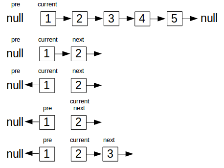

## LinkList

- **linklist reverse**  

<!--more-->

```java
public class linkListReverse{
    private static Node head = null;
    private static Node tail = null;

    public static class Node{
        private int val;
        private Node next;

        public Node(int val){
            this.val = val;
        }
        public static void insert(int val){
            Node node = new Node(val);
            node.next = null;
            if(head != null){
                tail.next = node;
                tail = node;
            }else{
                head = node;
                tail = node;
            }
        }
        public static void print(Node head){
            Node iter = head;
            while(iter != null){
                System.out.print(iter.val+" -> ");
                iter = iter.next;
            }
            System.out.println("null");
        }
        public static Node reverse(Node head){
            Node pre = null;
            Node current = head;
            Node next = null;
            while(current != null){
               next = current.next;
               current.next = pre;
               pre = current;
               current = next;
            }
            return pre;
        }
    }
    public static void main(String[] args){

        for(int i = 1; i <= 10; i++){
            Node.insert(i);
        }
        System.out.println("before reverse:");
        Node.print(head);
        Node reverseHead = Node.reverse(head);
        System.out.println("After reverse:");
        Node.print(reverseHead);
    }
}
```
