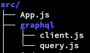
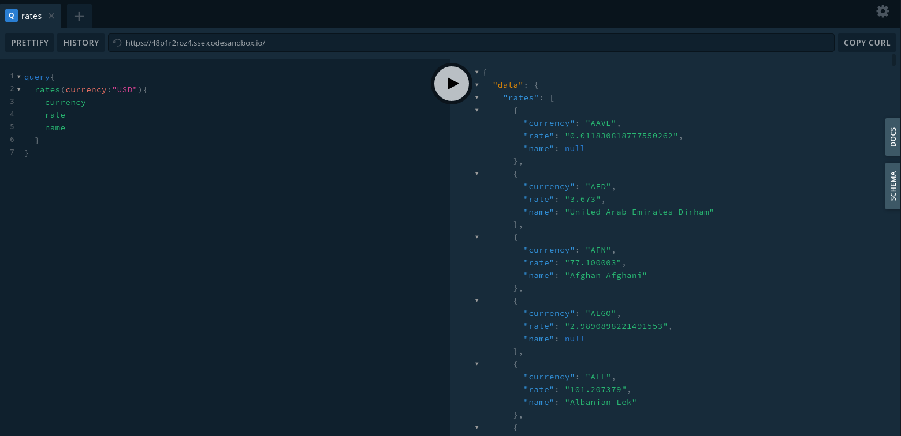
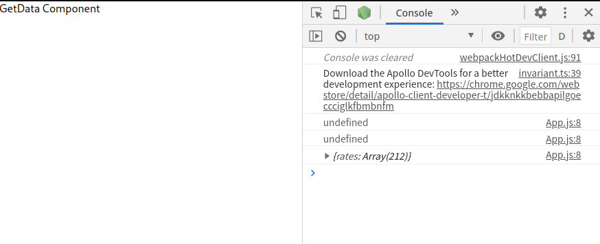

第一次遇到 Graphql 是第一個專案，專案用到的技術前端是 React,後端是 Graphql。我負責前端畫面和串接後端 API，後端是使用 Graphql，所以前端就需要用[Graphql-Client](https://www.apollographql.com/docs/react/)來和後端溝通。

後端的樣子會長的像[Graphql Playground](https://48p1r2roz4.sse.codesandbox.io/)，這是文件中的範例。右方會有自動生成的文件，可以看裡面有什麼 API 可以使用。

## Install

```bash
npm install @apollo/client graphql apollo-upload-client
```

> apollo-upload-client 如果之後要用到上傳檔案功能的話需要用到

## Setup

目錄結構



```js
// graphql/client.js
import { ApolloClient, InMemoryCache } from "@apollo/client"
import { createUploadLink } from "apollo-upload-client"

const link = createUploadLink({
  uri: "https://48p1r2roz4.sse.codesandbox.io",
})

const client = new ApolloClient({
  link: link,
  cache: new InMemoryCache(),
})
export default client
```

Query 的語法可以先在 Playground 測試完後在貼過來


```js
// graphql/query.js
import { gql } from "@apollo/client"

export const QUERY_RATE = gql`
  query QUERY_RATE {
    rates(currency: "USD") {
      currency
      rate
      name
    }
  }
`
```

```js
// App.js
import { ApolloProvider } from "@apollo/client"
import client from "./graphql/client"
import { useQuery } from "@apollo/client"
import { QUERY_RATE } from "./graphql/query"

const GetData = () => {
  const { data } = useQuery(QUERY_RATE)
  console.log(data)
  return <div>GetData Component</div>
}

function App() {
  return (
    <ApolloProvider client={client}>
      <GetData />
    </ApolloProvider>
  )
}

export default App
```

## Results


