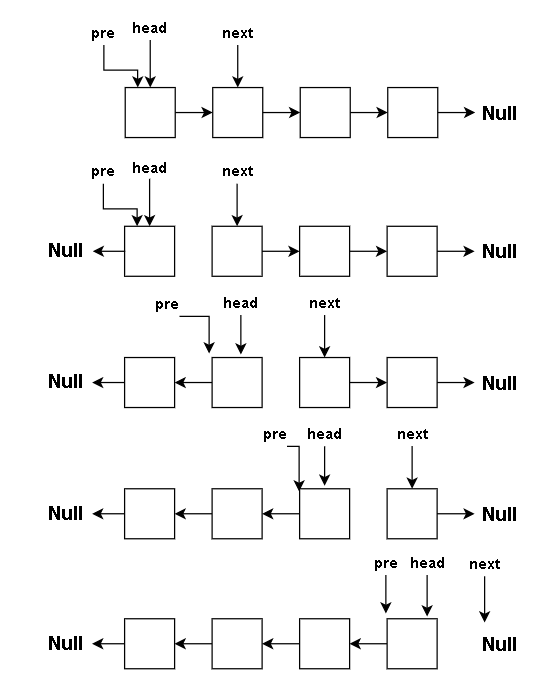
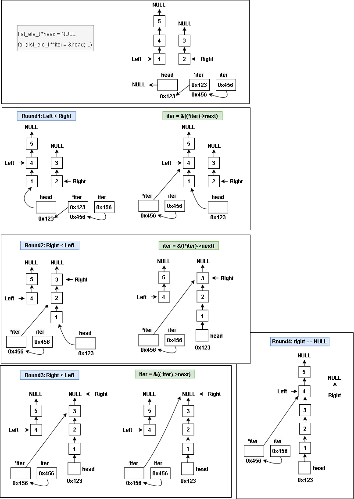

# 作業說明

- [課程連結](http://wiki.csie.ncku.edu.tw/linux/schedule)
- [J01: lab0](https://hackmd.io/@sysprog/linux2021-lab0)
- 取得作業程式碼[sysprog21/lab0-c](https://github.com/sysprog21/lab0-c)

# 作業目標

透過 linked list 實作 queue 的各種操作方法

- [x] new queue
- [x] free queue
- [x] insert head
- [x] insert tail
- [x] remove head
- [x] revesre queue
- [x] sort queue

# 執行方式

## 安裝必要檔案

```bash
sudo apt install build-essential git clang-format cppcheck aspell colordiff valgrind
```

## 執行檔案

```bash
make
make test # 執行自動評分測試
```

# 實作(修改 queue.c / queue.h)

## New queue(q_new)

```c
queue_t *q_new()
{
    queue_t *q = malloc(sizeof(queue_t));
    if (q) {
        q->head = NULL;
        q->tail = NULL;
        q->size = 0;
    }
    return q;
}
```

## Free queue(q_free)

```c
void q_free(queue_t *q)
{
    if (!q)
        return;

    list_ele_t *tmp = NULL;
    while (q->head) {
        tmp = q->head;
        q->head = tmp->next;
        free(tmp->value);
        free(tmp);
    }
    free(q);
}
```

## Insert head(q\_insert_head)

- 原本使用 strcpy()來複製字串，但在 commit 時會報錯 strcpy 已經棄用，於是改用 strncpy()。
  
- 複製完字串後要補上結束字元`\0`

```c
bool q_insert_head(queue_t *q, char *s)
{
    if (!q)
        return false;

    list_ele_t *newh;

    newh = malloc(sizeof(list_ele_t));
    if(!newh)·
        return false;

    newh->value = malloc(strlen(s) + 1);
    if (!newh->value) {
        free(newh);
        return false;
    }

    strncpy(newh->value, s, strlen(s));
    *(newh->value + strlen(s)) = '\0';

    newh->next = q->head;
    q->head = newh;

    if (q->size == 0) {
        q->tail = newh;
    }
    q->size += 1;

    return true;
}
```

## Insert tail(q\_insert_tail)

```c
bool q_insert_tail(queue_t *q, char *s)
{
    if (!q) {
        return false;
    }

    list_ele_t *node;
    node = malloc(sizeof(list_ele_t));

    if (!node) {
        return false;
    }
    node->value = malloc(strlen(s) + 1);
    node->next = NULL;

    if (!node->value) {
        free(node);
        return false;
    }

    strncpy(node->value, s, strlen(s));
    *(node->value + strlen(s)) = '\0';

    if (q->size == 0) {
        q->head = node;
    } else {
        q->tail->next = node;
    }
    q->tail = node;
    q->size += 1;

    return true;
}
```

## Remove queue head(q\_remove_head)

```c
bool q_remove_head(queue_t *q, char *sp, size_t bufsize)
{
    if (!q || !q->head) {
        return false;
    }

    list_ele_t *tmp = q->head;

    size_t headlen = strlen(tmp->value);
    size_t cpylen = headlen < bufsize - 1 ? headlen : bufsize - 1;

    if(sp){
        strncpy(sp, tmp->value, cpylen);
        *(sp + cpylen) = '\0';
    }

    q->head = tmp->next;
    q->size -= 1;

    free(tmp->value);
    free(tmp);

    return true;
}
```

## Queue size(q_size)

```c
int q_size(queue_t *q)
{
    if (!q) {
        return 0;
    }
    return q->size;
}
```

## Reverse queue (q_reverse)



```c
void q_reverse(queue_t *q)
{
    list_ele_t *pre = q->head;
    list_ele_t *next = q->head->next;
    q->tail = q->head;
    q->tail->next = NULL;

    while(next){
        q->head = next;
        next = next->next;
        q->head->next = pre;
        pre = q->head;
    }
}
```

## Sort queue(q_sort)

- 參考[Linux 核心設計 : Code Review I (2020)](https://youtu.be/3k_tJa-f_4M?t=6020)實作 merge sort
- 在自己定義的 function 加上`static`，能夠讓編譯器知道這個 function 只在這個檔案中使用，能夠達到最佳化。

```c
void q_sort(queue_t *q)
{
    if (!q || !q->head)
        return;
    q->head = mergeSort(q->head);

    for (; q->tail->next; q->tail = q->tail->next)
        ;
}
```

```c
static list_ele_t *mergeSort(list_ele_t *head)
{
    if (!head || !head->next)
        return head;

    list_ele_t *slow = head, *fast;

    for (fast = head->next; fast && fast->next; fast = fast->next->next) {
        slow = slow->next;
    }
    list_ele_t *mid = slow->next;
    slow->next = NULL;

    return merge(mergeSort(head), mergeSort(mid));
}
```


> 透過 slow, fast 來找到中間的 node,並將 linked list 切斷。\
slow 每次走一步, fast 每次走兩步, 當 fast 到底時, slow 剛好在中間的位置。


```c
static list_ele_t *merge(list_ele_t *left, list_ele_t *right)
{
    list_ele_t *head = NULL;

    for (list_ele_t **iter = &head; true; iter = &((*iter)->next)) {
        if (!left) {
            *iter = right;
            break;
        }
        if (!right) {
            *iter = left;
            break;
        }
        if (strcmp(left->value, right->value) < 0) {
            *iter = left;
            left = left->next;
        } else {
            *iter = right;
            right = right->next;
        }
    }

    return head;
}
```

- 用範例理解執行過程



## 執行測試

```bash
make
./qtest     # 進入cmd模式
cmd> new    # 建立queue
cmd> ih cat # insert head
[cat]
cmd> it dog # insert tail
[cat dog]
cmd> rh     # remove head
Removed cat from queue
q = [dog]
cmd> it cat
q = [dog cat]
cmd> it tom
q = [dog cat tom]
cmd> reverse
q = [tom cat dog]
cmd> sort
q = [cat dog tom]
```
