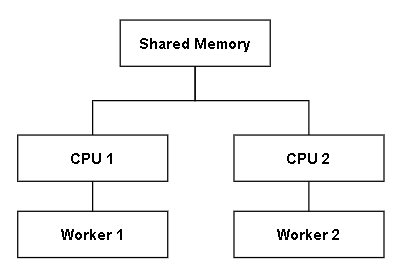

- [ECMAScript Language Specification](https://tc39.es/ecma262/)

# Content

- [ES6 (ECMAScript 2015)](#ES6)
- [ES7 (ECMAScript 2016)](#ES7)
- [ES8 (ECMAScript 2017)](#ES8)
- [ES9 (ECMAScript 2018)](#ES9)
- [ES10 (ECMAScript 2019)](#ES10)
- [ES11 (ECMAScript 2020)](#ES11)
- [ES12 (ECMAScript 2021)](#ES12)

<h1 id="ES6">ES6 (ECMAScript 2015)</h1>

### 1. let/const

**let**
以前在宣告變數都使用全域的`var`在 ES6 新增了`let`可以更明確的規範變數作用的範圍。

```js
function f() {
  let x = 1
  {
    console.log(x) // 1
    let y = 2
  }
  console.log(y) // Uncaught ReferenceError: y is not defined
}
f()
```

**const**
簡化了定義常數的宣告，常數必須初始化且不能變更。

```js
const PI = 3.14
```

### 2. arrow functions

```js
var a = [1, 2, 3, 4, 5]
//ES5
a.map(function (v) {
  return v + 1
})
//ES6
a.map(v => v + 1)
```

### 3. classes

加入 classes，定義 class 更直觀。在 ES5 以前定義物件很複雜，沒有 class 關鍵字，所以會看到很多`XXX.prototype.YYY`的語法，在 ES6 幾乎看不見，精簡許多。

- ES6 建立 Stack Class

```js
class Stack {
  constructor() {
    this.stack = []
  }
  push(num) {
    this.stack.push(num)
  }
  pop() {
    return this.stack.pop()
  }
  size() {
    return this.stack.length
  }
}

s = new Stack()
s.push(1)
s.push(2)
s.push(3)
s.pop() // 3
s.size() // 2
```

- ES6 之前的寫法

```js
const Stack = function () {
  this.stack = []
}
Stack.prototype.push = function (num) {
  this.stack.push(num)
}
Stack.prototype.pop = function () {
  return this.stack.pop()
}
Stack.prototype.size = function () {
  return this.stack.length
}
```

- 繼承寫法

```js
class Animal {
  constructor(name, leg) {
    this.name = name
    this.leg = leg
  }
  bark() {
    console.log("animal bark")
  }
}
class Cat extends Animal {
  constructor({ name, leg }) {
    super(name, leg)
    this.run = true
    this.fly = false
  }
  bark() {
    console.log("meow")
  }
}

let cat = new Cat({ name: "Jack", leg: 4 })
cat // Cat {name: "Jack", leg: 4, run: true, fly: false}
cat.bark() // meow
```

### 4. template string

允許在字串中插入變數，不用像以前一樣做字串串接。

```js
let name = "Tom"
let template = `Hello, ${name}.` // "Hello, Tom."
```

### 5. destructuring

在拆解陣列或是物件時更方便

```js
let num = [1, 2, 3]
let [a, b, c] = num // a = 1, b = 2, c = 3
```

```js
let obj = { a: 1, b: 2, c: 3 }
let { a, b, c } = obj
console.log(a, b, c) // 1, 2, 3
```

### 6. default + rest + speard

- default

  在傳遞參數允許設定預設值，能夠預防一些例外產生
  e.g.

```js
let f = (a = 1, b = 2, c = 3) => {
  console.log(a, b, c)
}
f() // 1 2 3
f(4, 5) // 4 5 3
f(4, 5, 6) // 4 5 6
```

- rest

  在使用函數或是設計函數上可能會遇上不確定到底要幾個參數，
  ES6 可以讓你在這方面更有彈性。不確定的參數使用`...p`作表示，p 為一個陣列。

```js
let f = (a, ...rest) => {
  console.log(a, rest)
}
f(1, 2, 3, 4, 5) // 1 [2, 3, 4, 5]
```

- spread

```js
let arr1 = [1, 2, 3]
let arr2 = [4, 5, 6]
let arr3 = [...arr1, ...arr2] // [1, 2, 3, 4, 5, 6]
```

### 7. iterators + for..of

```js
let nums = [1, 2, 3, 4]
for (let n of nums) {
  console.log(n)
}
/*
	1
	2
	3
	4
*/
```

### 8. Generators
* 一般function
```js
  function f() {
      console.log('1.')
      console.log('2.')

      return 'Hello World'
  }
```
* generator function\
會在function保留字後面在加上星號(*)\
generator function回傳值是generator object, 是一個iterator\
genertaor function內使用`yield`來暫停執行。
```js
  function* f() {
      yield 'yield 1.'
      console.log('1.')

      yield 'yield 2.'
      console.log('2.')

      return 'Hello World'
  }

  const iter = f()
  iter.next() // {value: 'yield 1.', done: false}
  iter.next() // {value: 'yield 2.', done: false}
  iter.next() // {value: 'Hello World', done: true}
```

```js
function* f() {
  yield 'a'
  yield 'b'
  yield 'c'
  yield 'd'
}

const iter = f()
console.log([...iter]) // [a, b, c, d]
```

* Reference
  - [💡🎁 JavaScript Visualized: Generators and Iterators - DEV Community 👩‍💻👨‍💻](https://dev.to/lydiahallie/javascript-visualized-generators-and-iterators-e36)
  - [ES6 Generator 基礎 #1](https://github.com/aszx87410/blog/issues/1)

### 9. unicode

```js
s = "\u{1F602}" //"😂"
```

### 10. modules

```js
// a.js
const a = () => {
  console.log("a.js")
}
module.exports = a
```

```js
// b.js
import a from "./a"
a() // a.js
```

### 11. map/set/weakmap/weakset

- map / [weakmap](https://developer.mozilla.org/en-US/docs/Web/JavaScript/Reference/Global_Objects/WeakMap)

  Map 的 key 值可以是任意型態(int, string, array) \
  WeakMap 的 key 值只能是物件

```js
let map = new Map()
map.set(1, "1")
map.set("a", "a")
map.set(["arr1"], ["arr2"])
map // {1 => "1", "a" => "a", ["arr1"] => ["arr2"]}

let weakmap = new WeakMap()
weakmap.set(1, "1")
// Uncaught TypeError: Invalid value used as weak map key
weakmap.set("a", "a")
// Uncaught TypeError: Invalid value used as weak map key
weakmap.set(["arr1"], ["arr2"]) // {["arr1"] => ["arr2"]}
```

- set / [weakset](https://developer.mozilla.org/en-US/docs/Web/JavaScript/Reference/Global_Objects/WeakSet)

Set 與 WeakSet 差異: Set 能夠儲存隨意型態(int, string, array), WeakSet 只能夠儲存物件。

```js
let set = new Set()
set.add(1).add(2).add(5) // {1, 2, 5}
set.add(2) // {1, 2, 5}
set.add("2") // // {1, 2, 5, "2"}
set.add([1, 2, 3]) // {1, 2, 5, "2", [1,2,3]}
set.size // 5

let weakset = new WeakSet()
weakset.add(1)
// Uncaught TypeError: Invalid value used in weak set
weakset.add([1, 2, 3]) // {[1,2,3]}
weakset.add([1, 2, 3]) // {[1,2,3], [1,2,3]}
```

### 12. proxying/refection

### 13. symbols

symbol 是 ES6 新增的一種基本數據型態(primitive data type)。\
基本型態有七種: string，number，bigint，boolean，null，undefined，symbol。\
特性: **唯一**且不可改變(immutable)的資料型態，可用來識別物件的屬性。

```js
let a = Symbol("123")
let b = Symbol("123")
a === b // false
```

```js
let a = Symbol("aaa")
let b = Symbol("bbb")
let obj = { [a]: 123, [b]: 456 }
obj // {Symbol(aaa): 123, Symbol(bbb): 456}
```

### 14. promises

程式常常需要做 request 到後端來取得資料，但 server 並不會馬上回傳資料，要等待 server 處理的時間。這時程式就必須停下來等待，造成時間浪費。

ES6 提出了 promise 來解決這個非同步(asynchronously)的狀況。當發送 request 到 server 後，並不會停下來等 server 處理完，而是留下 callback 後，繼續執行後面任務。

當 server 成功處理好拿到資料準備回傳時，再去執行剛剛留下的 callback function。留下的 callback function 有分為 request 呼叫成功(resolve)與 request 呼叫失敗(reject)。

```js
const callServer = time => {
  return new Promise((resolve, reject) => {
    if (time <= 300) {
      setTimeout(() => resolve({ msg: "request success!" }), time)
    } else {
      setTimeout(() => reject({ msg: "request failed!" }), time)
    }
  })
}
callServer(200).then(res => console.log(res))
// {msg: "request success!"}
callServer(400)
  .then(res => console.log(res))
  .catch(e => console.log(e)) // <--
// {msg: "request failed!"}
```

### 15. binary and octal literals

支援二進位與八進位表示

```js
0b111 //7
0o123 //83
```

```js
let num = "1010"
let binNum = `0b${num}`
let decNum = BigInt(binNum) // 10n
decNum.toString(2) // "1010"
```

- [Leetcode #67](https://leetcode.com/problems/add-binary/)

<h1 id="ES7">ES7 (ECMAScript 2016)</h1>

### 1. Exponentiation Operator

```js
2 ** 3 // 8
```

### 2. Array.includes()

```js
let arr = ["Tom", "Jack", "David"]
arr.includes("Tom") // true
```

<h1 id="ES8">ES8 (ECMAScript 2017)</h1>

### 1. Async functions [(MDN)](https://developer.mozilla.org/zh-TW/docs/Web/JavaScript/Reference/Statements/async_function)

可以用來簡化 ES6 Promise 寫法，await 表達式只能在 async 函式內部使用，await 會等待 Promise 解析完畢才會繼續往下執行。

之前 ES6 Promise 範例，在 callServer()之後要處理回傳的 Promise 需要使用`.then()`來接。若拿回來的資料還要當做其他 function 的 input 會遇到`.then().then().then()`的狀況。

```js
const callServer = time => {
  return new Promise((resolve, reject) => {
    if (time <= 300) {
      setTimeout(() => resolve({ msg: "request success!" }), time)
    } else {
      setTimeout(() => reject({ msg: "request failed!" }), time)
    }
  })
}
callServer(200).then(res => console.log(res))
// {msg: "request success!"}
callServer(400)
  .then(res => console.log(res))
  .catch(e => console.log(e)) // <--
// {msg: "request failed!"}
```

ES8 async function 可以改善處理 promise 的寫法。

```js
const callServer = time => {
  return new Promise((resolve, reject) => {
    if (time <= 300) {
      setTimeout(() => resolve({ msg: "request success!" }), time)
    } else {
      setTimeout(() => reject({ msg: "request failed!" }), time)
    }
  })
}
const run = async () => {
  let success = await callServer(200)
  let error = {}
  try {
    error = await callServer(400)
  } catch (err) {
    error = err
  }

  console.log(success) // {msg: "request success!"}
  console.log(error) // {msg: "request failed!"}
}
run()
```

### 2. Object.entries

```js
let obj = { a: 1, b: 2, c: 3 }

for (let [key, value] of Object.entries(obj)) {
  console.log(key, value)
}
/*
  a 1
  b 2
  c 3
*/
```

### 3. Object.values

```js
let obj = { a: 1, b: 2, c: 3 }

for (let value of Object.values(obj)) {
  console.log(value)
}
/*
  1
  2
  3
*/
```

### 4. Object.getOwnPropertyDescriptors

```js
let obj = { a: 1, b: 2, c: 3 }

let descriptors = Object.getOwnPropertyDescriptors(obj)

descriptors

/*
{
  a: {value: 1, writable: true, enumerable: true, configurable: true}
  b: {value: 2, writable: true, enumerable: true, configurable: true}
  c: {value: 3, writable: true, enumerable: true, configurable: true}
}
*/
```

### 5. String.padStart() [(MDN)](https://developer.mozilla.org/zh-TW/docs/Web/JavaScript/Reference/Global_Objects/String/padStart), String.padEnd() [(MDN)](https://developer.mozilla.org/en-US/docs/Web/JavaScript/Reference/Global_Objects/String/padEnd)

- String.padStart()

  > str.padStart(targetLength [, padString])

```js
"101".padStart(8) // "     101"
"101".padStart(8, "0") // "00000101"
"101".padStart(8, "xyz") // "xyzxy101"
```

- String.padEnd()

```js
"101".padEnd(8) // "101     "
"101".padEnd(8, "0") // "10100000"
"101".padEnd(8, "xyz") // "101xyzxy"
```

### 6. Shared memory and Atomic

- [tc39/ecmascript_sharedmem](https://github.com/tc39/ecmascript_sharedmem/blob/master/TUTORIAL.md)
- [Web Workers](https://developer.mozilla.org/zh-TW/docs/Web/API/Web_Workers_API/Using_web_workers)



Atomic 是類似鎖，當 CPU1 在讀寫 shared memory 時，會把 shared memory 中的值複製一份到 cache 中。在讀寫時把 shared memory 鎖住，讓其他 CPU 不能夠讀寫，避免複製到舊的值，確保資料一致性。

<h1 id="ES9">ES9 (ECMAScript 2018)</h1>

### 1. Object rest and spread

在 ES6 加入的 rest 與 spread 只能針對陣列做展開，ES8 擴展到也能夠針對物件展開。

```js
let obj = { a: 1, b: 2, c: 3 }
let { a, ...rest } = obj
a // 1
rest // {b: 2, c: 3}
```

### 2. Promise.finally

不管 Promise 是 resolve 還是 reject 都會執行 finally()，可以用來關閉 loading 狀態。

```js
const fetchData = time => {
  return new Promise((resolve, reject) => {
    if (time <= 300) {
      setTimeout(() => resolve({ data: "request success" }), time)
    } else {
      setTimeout(() => reject({ data: "request failed!" }), time)
    }
  })
}

const run = async () => {
  fetchData(400)
    .then(({ data }) => console.log(data))
    .catch(err => console.log(err))
    .finally(() => console.log("finally"))
}
run()

// {data: "request failed!"}
// finally
```

### 3. Asynchronous Iteration

支援在 for 迴圈內呼叫非同步 function。

```js
const fetchData = time => {
  return new Promise((resolve, reject) => {
    setTimeout(() => resolve(`success: ${time}ms`), time)
  })
}

const run = async () => {
  let times = [500, 1000, 2000]
  for await (let ms of times) {
    fetchData(ms).then(res => console.log(res))
  }
}
run()
// success: 500ms
// success: 1000ms
// success: 2000ms
```

### 4. Regular Expression Features

- Named capture groups\
  在正規表達式內使用`?<name>`來幫 group 取名字

```js
const re = /(?<year>[0-9]{4})-(?<month>[0-9]{2})-(?<day>[0-9]{2})/
const match = re.exec("2021-09-05")
match.groups // {year: "2021", month: "09", day: "05"}
```

- dotAll\
  [tc39/proposal-regexp-dotall-flag](https://github.com/tc39/proposal-regexp-dotall-flag)

  `.`在正規表達式中代表任意字元，但不能是換行符號(line terminator)

  ```c
  /foo.bar/.test("fooAbar") // true
  /foo.bar/.test("foo\nbar") // false
  ```

  建議解決方案\
  增加 s flag，讓`.`能夠匹配任何字元包含換行符號

  ```c
  /foo.bar/s.test("foo\nbar") // true
  ```

- lookbehind assertions \
  [tc39/proposal-regexp-lookbehind](https://github.com/tc39/proposal-regexp-lookbehind)

  - Positive `(?<=...)`\
    `(?<=x)y`表示 x 後面接著 y，才會匹配 y
    ```js
    let re = /(?<=\$)\d+\.\d+/
    re.exec("$10.53")
    // ["10.53", index: 1, input: "$10.53", groups: undefined]
    re.exec("€10.53") // null
    ```
  - Negative `(?<!...)`\
    `(?<!x)y`表示 x 後面不是 y，才會匹配 y

- Unicode property escapes\
   [tc39/proposal-regexp-unicode-property-escapes](https://github.com/tc39/proposal-regexp-unicode-property-escapes)
  ```js
  const regexGreekSymbol = /\p{Script=Greek}/u
  regexGreekSymbol.test("π") // true
  ```

### 5. Escape sequences allowed in tagged template literals

```js
const tagged = (s, version, year) => {
  console.log(s)
  console.log(version)
  console.log(year)
}

let version = "ES9"
let year = 2018

console.log(tagged`This is ${version} (ECMAScript${year}).`)
/* 
  ["This is ", " (ECMAScript", ").", raw: Array(3)]
  ES9
  2018
*/
```

<h1 id="ES10">ES10 (ECMAScript 2019)</h1>

### 1. Array.flat() [(MDN)](https://developer.mozilla.org/en-US/docs/Web/JavaScript/Reference/Global_Objects/Array/flat) / Array.flatMap() [(MDN)](https://developer.mozilla.org/en-US/docs/Web/JavaScript/Reference/Global_Objects/Array/flatMap)

- flat(deep)

```js
let arr1 = [1, 2, [3, 4]]
arr1.flat() // [1, 2, 3, 4]

let arr2 = [1, 2, [3, 4, [5, 6]]]
arr2.flat() // [1, 2, 3, 4, [5, 6]]
arr2.flat(2) // [1, 2, 3, 4, 5, 6]

let arr3 = [1, 2, [3, 4, [5, 6, [7, 8, [9, 10]]]]]
arr3.flat(Infinity) // [1, 2, 3, 4, 5, 6, 7, 8, 9, 10]
```

- flatMap()\
  和 map()差在 map()完會再經過一層的 flat()展開。

### 2. Object.fromEntries()[(MDN)](https://developer.mozilla.org/en-US/docs/Web/JavaScript/Reference/Global_Objects/Object/fromEntries)

把 Map、Array 傳換成物件。

```js
const map = new Map([
  ["a", 1],
  ["b", 2],
])
map // Map(2) {'a' => 1, 'b' => 2}
Object.fromEntries(map) // {a: 1, b: 2}
```

```js
let arr = [
  ["a", 1],
  ["b", 2],
  ["c", 3],
]
Object.fromEntries(arr) // {a: 1, b: 2, c: 3}
```

### 3. String.trimStart() / String.trimEnd()

去除左邊/右邊空白並返回一個新的字串，不會直接修改原來的值。

```js
let s = "   hello   "
s.trimStart() // 'hello   '
s.trimEnd() // '   hello'
```

<h1 id="ES11">ES11 (ECMAScript 2020) </h1>

### 1. string.matchAll() [(MDN)](https://developer.mozilla.org/en-US/docs/Web/JavaScript/Reference/Global_Objects/String/matchAll)

```js
let s = "abcdacd"
console.log([...s.matchAll(/a/g)])
/*
[
  ['a', index: 0, input: 'abcdacd', groups: undefined],
  ['a', index: 4, input: 'abcdacd', groups: undefined]
]
*/
```

### 2. BigInt

遇到類似[Leetcode 1985](https://leetcode.com/problems/find-the-kth-largest-integer-in-the-array/)這類問題，
Number 型態已經不足夠表示。Number 型態表示上限為$2^{53} - 1$。

```js
Math.pow(2, 53) // 9007199254740992
Number.MAX_SAFE_INTEGER // 9007199254740991

Number.MAX_SAFE_INTEGER + 1 // 9007199254740992
Number.MAX_SAFE_INTEGER + 2 // 9007199254740992

BigInt(Number.MAX_SAFE_INTEGER) + BigInt(1) // 9007199254740992n
BigInt(Number.MAX_SAFE_INTEGER) + BigInt(2) // 9007199254740993n
```

### 3. Promise.allSettled

Promise.all() 在遇到 reject 時會停止後續動作(short-circuit)，直接噴錯。\
Promise.allSettled() 其中有遇到 reject 還是會將其他 promise 執行完畢。

```js
let promise1 = Promise.resolve(3)
let promise2 = new Promise((resolve, reject) => {
  setTimeout(reject("error"))
})
let promise3 = 42

Promise.all([promise1, promise2, promise3])
  .then(values => {
    console.log(values)
  })
  .catch(() => console.log("error"))
// error

Promise.allSettled([promise1, promise2, promise3]).then(values => {
  console.log(values)
})
/*
[
  { status: 'fulfilled', value: 3 },
  { status: 'rejected', reason: 'error' },
  { status: 'fulfilled', value: 42 }
]
*/
```

### 4. globalThis

```c
var a = 10 // Window{..., a: 10, ...}

(function () {
  let a = 20
  console.log(a) // 20
  console.log(this.a) // 10
  console.log(window.a) // 10
  console.log(frames.a) // 10
  console.log(globalThis.a) // 10
})()
```

### 5. Nullish coalescing Operator (??) [(MDN)](https://developer.mozilla.org/en-US/docs/Web/JavaScript/Reference/Operators/Nullish_coalescing_operator)

`??`左側為否定只判斷`null`和`undefined`

```js
console.log(null ?? "hello") // hello
console.log(undefined ?? "hello") // hello
console.log(false ?? "hello") // false
console.log(0 ?? "hello") // 0
console.log("" ?? "hello") // ""

console.log(null || "hello") // hello
console.log(undefined || "hello") // hello
console.log(false || "hello") // hello
console.log(0 || "hello") // hello
console.log("" || "hello") // hello
```

### 6. Optional Chaining (?.)

```js
let a = {
  b: {
    c: 1,
  },
}
a.b.c // 1
a.d.c // TypeError: Cannot read properties of undefined
a?.d?.c // undefined
```

### 7. module

- import()\
  支援動態載入，可在需要時才 import。
- import.meta
- export \* as ns from 'module'

<h1 id="ES12">ES12 (ECMAScript 2021) </h1>

### 1. replaceAll

```js
let str = "ABCDFABCGHIABC"
str.replaceAll("ABC", "xxx") // 'xxxDFxxxGHIxxx'
```

```js
str.replace(/ABC/g, "xxx") // 'xxxDFxxxGHIxxx'
```

### 2. [Promise.any](https://github.com/tc39/proposal-promise-any)

> a Promise combinator that short-circuits when an input value is fulfilled (遇到的第一個 Promise 是 fullilled 就回傳,後面的都不做了)

- Promise.all

  所有的 Promise 都要 fulfilled 否則報錯

- Promise.allSettled

  遇到 Promise 是 rejected 還是會把後面的 Promise 做完

- Promise.any

  會傳第一個 fulfilled 的 Promise，之後的 Promise 不執行。\
  若全部都是 rejected 則報錯(`Uncaught (in promise) AggregateError: All promises were rejected`)

### 3. AggregateError

> a new Error type to represent multiple errors at once (一個新的 Error type, 把多個 Errors 包在一起)

```js
Promise.any([
  Promise.reject("error1"),
  Promise.reject("error2"),
  Promise.reject("error3"),
]).catch(err => err)

/*
AggregateError{
  errors: (3) ['error1', 'error2', 'error3']
  message: "All promises were rejected"
  stack: "AggregateError: All promises were rejected"
}
*/
```

### 4. `??=`, `&&=`, `||=`

```js
let a = undefined
let b = 1

a ??= b // 如果a是nullish(null, undefined), 將b賦值到a
```

```js
let a = 1
a &&= 10 // 如果a是truthy,則賦值到a (a = 10)

let b = 0
b &&= 10 // 如果b是falsy,則不賦值 (b = 0)
```

```js
let a = 1
a ||= 10 // 如果a是truthy,則不賦值 (a = 0)

let b = 0
b ||= 10 // 如果b是falsy,則賦值到b (b = 10)
```

### 5. WeakRef

> for referring to a target object without preserving it from garbage collection

### 6. FinalizationRegistry

> to manage registration and unregistration of cleanup operations performed when target objects are garbage collected (在註冊的物件被回收時,執行 callback)

```c
const r = new FinalizationRegistry(
  () => console.log("callback")
);

(() => {
  let obj = { a: 1, b: 2 }
  r.register(obj)
})();
```
