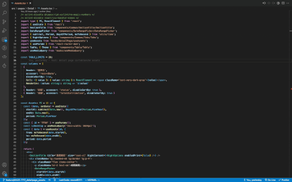

## 視窗
* 在右側視窗開啟檔案 `cmd+option click`

  
* 開關檔案目錄 `cmd+b`
* 開關command line視窗 `cmd+j`
* 切換分頁 `cmd+1`, `cmd+2`, `cmd+3`
* 關閉分頁 `cmd+w`
* 關閉所有分頁 `cmd+k cmd+w`

## 搜尋
* 搜尋檔案 `cmd+p`
* 跳到相同字位置 `ctrl+f`
* 選取相同字 `cmd+d`
* 搜尋整個專案關鍵字 `cmd+shift+f`

## 瀏覽器
* 將目前分頁加到書籤 `cmd+d`

## Reference
* [vscode keyboard shortcuts](https://code.visualstudio.com/shortcuts/keyboard-shortcuts-macos.pdf)