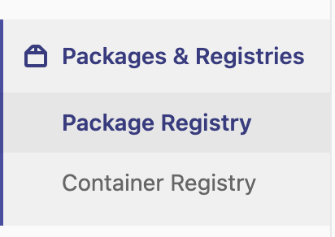
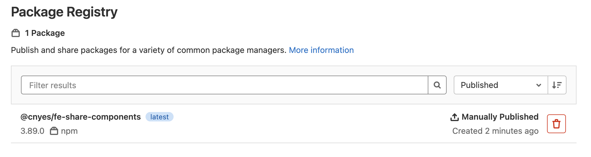
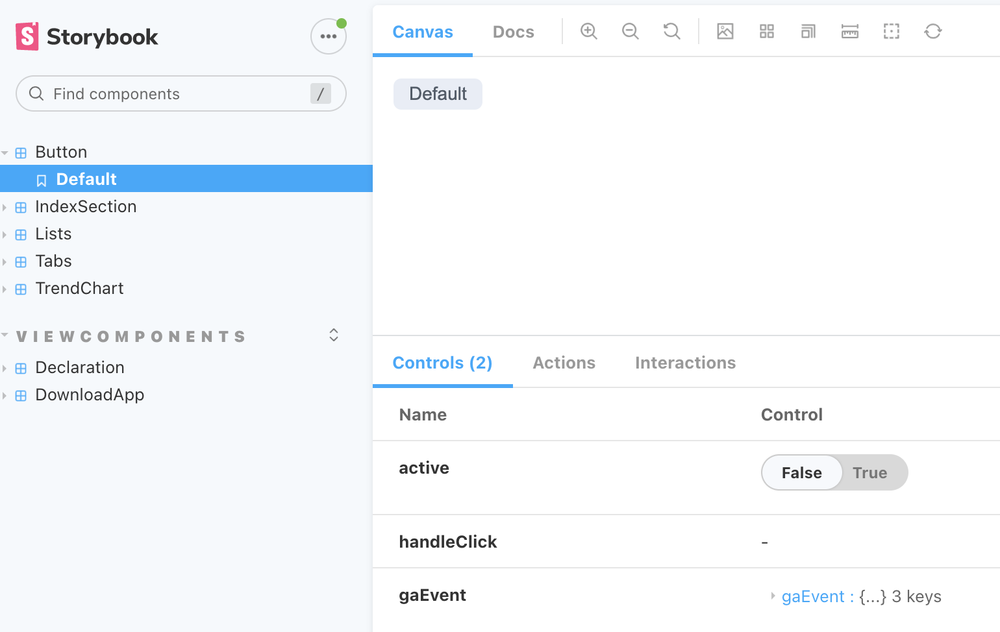
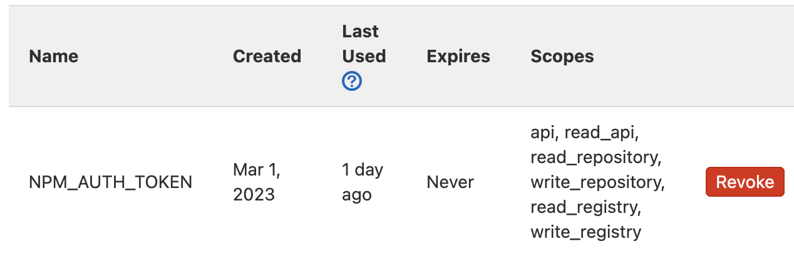
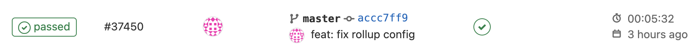
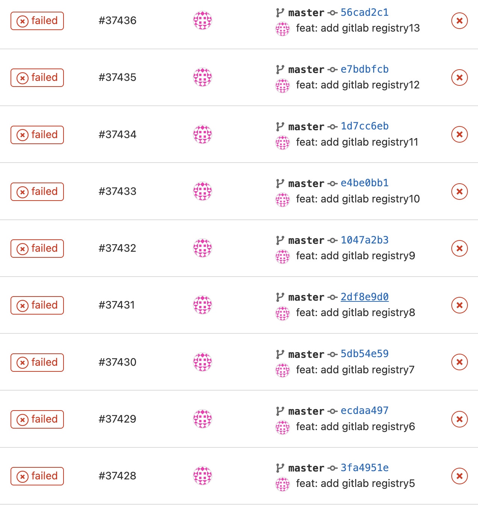

要怎麼把公司UI共用元件庫打包發佈讓所有專案能夠使用又不希望上傳到公開的元件庫？

一般下載套件如使用yarn作為套件管理工具都是到公開元件 https://yarnpkg.com/ 做下載，但公司的東西不希望放到公開的地方，希望能夠放到自己的機器上。目前公司是將所有程式碼都存放在自己架Gitlab機器上。

前端的共用UI元件庫要怎麼推到Gitlab上，並可以從Gitlab做下載呢？\
Gitlab有提供Packages & Registries(圖1)讓套件上傳的空間。配合CICD每次push或增加tag時能夠一併做發佈的動作(圖2)

|圖1|圖2|
|---|---|
|| |

## 之前做法
直接把原始碼與編譯後的檔案推到Gitlab上，然後增加tag來區分不同版本。

```plain
yarn add https://<gitlab-url>/fe-common-library.git#3.89.0
```
直接把整包放到node\_modules中，會造成node\_modules裡面包了其實用不到的原始碼。


node_modules迷因


## 流程步驟
1. 開發元件並透過[Storybook](https://storybook.js.org/)UI開發工具預覽
2. 透過[Webpack](https://webpack.js.org/), [Rollup](https://rollupjs.org/) 等工具編譯打包
3. 建立CICD, 每次push時自動發佈到Gitlab Registry
4. 安裝至使用的專案

## 1. 開發元件
透過[Storybook](https://storybook.js.org/)可以方便預覽每個元件的樣式與有什麼參數可以使用。例如按鈕元件，可以透過下方控制欄看出有什麼參數可以使用，與觸發時的樣式預覽。



## 2.  透過Rollup編譯打包
[Rollup](https://rollupjs.org/) 輕量的打包工具，只要有一個設定檔rollup.config.js, 執行rollup -c編譯就可以產出對應的輸出打包檔案。

* rollup.config.js

```js
import resolve from "@rollup/plugin-node-resolve";
import commonjs from "@rollup/plugin-commonjs";
import peerDeps from "rollup-plugin-peer-deps-external";
import { terser } from "rollup-plugin-terser";
import postcss from "rollup-plugin-postcss";
import typescript from "@rollup/plugin-typescript";
import image from "@rollup/plugin-image";
import babel from "@rollup/plugin-babel";
import pkg from "./package.json";

const extensions = [".js", ".jsx", ".ts", ".tsx"];

export default [
  {
    input: "./src/index.ts",
    output: [
      {
        file: pkg.main,
        format: "cjs",
      },
      {
        file: pkg.module,
        format: "esm",
      },
    ],
    plugins: [
      commonjs(),
      resolve({ extensions }),
      peerDeps({
        includeDependencies: true,
      }),
      terser(),
      postcss(),
      typescript(),
      image(),
      babel({ babelHelpers: "bundled", extensions }),
    ],
  },
];
```

input程式進入點, output打包後檔案的檔名、路徑與輸出格式。\
plugins可以加入一些額外擴充功能

* package.json

```json
{
  "main": "build/index.js",
  "module": "build/index.es.js",
  "scripts": {
    "build": "rollup -c",
  },
  ...
}
```

## 3. 發佈到Gitlab Registry

到 Settings > Access Token 新增 Project Access Tokens (將token加入環境變數)\
token可以到使用者的Edit Profile中註冊一個



<br/>

設定CICD (Gitlab只要偵測到專案內有.gitlab-ci.yml就會執行對應的CICD)

```yml
# .gitlab-ci.yml 
image: node:12.20.0

stages:
  - deploy

deploy:
  stage: deploy
  script:
    - yarn publish
```

建立一個node環境並執行yarn publish。只要push時就會執行，可以在這裡設定成新增tag才執行推版動作。\
當git push時觸發CICD，在Gitlab CI/CD的頁面就會像這樣，如果推版成功就會有綠色勾勾。



<br />

yarn publish會根據.yarnrc.yml設定檔來決定佈署的地方與權限設定
```yml
# .yarnrc.yml
npmScopes:
  cnyes:
    npmPublishRegistry: "${CI_API_V4_URL}/projects/${CI_PROJECT_ID}/packages/npm/"
    npmAlwaysAuth: true
    npmAuthToken: "${NPM_AUTH_TOKEN}"
```
CI開頭的變數名稱都是Gitlab內建的不用另外設定\
這裡的`NPM_AUTH_TOKEN`就會拿到上面的Access Token

執行yarn publish時，會依照package.json設定做打包。
```json
# package.json
{
  "name": "@cnyes/fe-share-components",
  "files": [
    "build",
    ".npmrc"
  ],
  "publishConfig": {
	"@cnyes:registry": "https://<gitlab-url>/api/v4/projects/<project-id>/packages/npm/"
  },
}
```
files定義需要打包哪些檔案\
`<gitlab-url>`與`<project-id>`輸入自己的gitlab網址與專案ID

如果有設定權限還需要設定npmrc

```plain
# .npmrc
@cnyes:registry=https://<gitlab-url>/api/v4/projects/<project-id>/packages/npm/
//<gitlab-url>/api/v4/projects/<project-id>/packages/npm/:_authToken=<access-token>
```

<br/>

可能會稍微遇到一些問題，但應該都可以解掉...吧



## 安裝至使用專案

```sh
yarn add @cnyes/fe-share-components
```

預設會到公開的地方下載套件，但是如果是到gitlab需要再設定`.npmrc`來設定`@cnyes`這個群組名稱要去哪裡下載

```plain
# .npmrc
@cnyes:registry=https://<gitlab-url>/api/v4/projects/<project-id>/packages/npm/
//<gitlab-url>/api/v4/projects/<project-id>/packages/npm/:_authToken=<access-token>
```

<br/>

在元件內引入方式
```ts
import { Button } from '@cnyes/fe-share-components';
```


## Reference
* [Publish packages with Yarn | GitLab](https://docs.gitlab.com/ee/user/packages/yarn_repository/)
* [(10) GitLab NPM Registry Demo - YouTube](https://www.youtube.com/watch?v=yvLxtkvsFDA)
