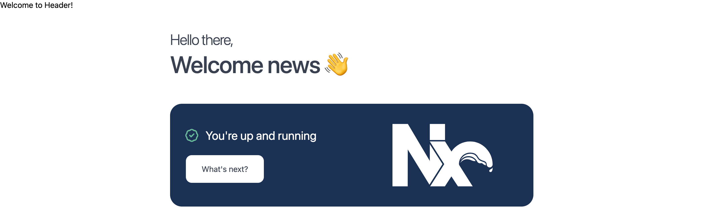

## 目錄
* [改版原因](#改版原因)
* [Tech Stack](#tech-stack)
* [建立專案](#建立專案)
* [Next13](#next13)
* [結論](#結論)

## <h2 id="改版原因">改版原因</h2>
[鉅亨網新聞網站](https://news.cnyes.com/news/cat/headline)大約是2017做了一次改版,當時使用的相關技術是Node8, React15, Redux與前人找了一個使用Express實作Server Side Render的樣板作為基底。六年後的2023,目前Node穩定版本已經來到18, React18,也陸續出現實作SSR的框架例如Nextjs, Remix。

React16.8推出React hooks寫法後, 寫Class Component的人就越來越少, 前人一開始建立的MVC架構與Redux也隨著經手的人越來越多漸漸的遠離一開始的規劃, 現在能在看見View層呼叫API, 所有的實作邏輯都集中在一個檔案, 一個檔案有1700多行, 當state, props改變時會造成多餘的畫面重新渲染, 後續接手的人也越來越改不動。

Node版本過舊,一些新的JavaScript語法不支援,相關套件只安裝較舊的版本或是不能使用。

## <h2 id="tech-stack">Tech Stack</h2>
* [Next13](https://nextjs.org/)
* [React18](https://react.dev/)
* [Node18](https://nodejs.org/en)
* [Linaria](https://github.com/callstack/linaria)
* [Nx](https://nx.dev/)

在考慮SEO情況下勢必是要選擇SSR, Next在處理SSR與CSR之間已經處理掉很多問題, 加上Next13已由beta版本變為穩定版本。新的[Server Component](https://nextjs.org/blog/next-13)應該也解決了很多Client與Server間的問題。

Linaria是一個CSS的框件,主打是Zero-runtime CSS in JS, 業界標竿Airbnb也導入了這個CSS library[Airbnb’s Trip to Linaria](https://medium.com/airbnb-engineering/airbnbs-trip-to-linaria-dc169230bd12)

Nx則是希望未來能夠整合推版流程, 目前鉅亨網的專案是一個項目就開一個gitlab repository, 目前大約有接近10個repository, 會造成一個相同的功能在A,B,C專案都要用到, 就必須要推3次版, 如果是動到Header全部專案都有用到就必須每個專案都各別推版。Nx是其中一個monorepo架構的實作,未來如果專案都整合到monorepo中能夠改善推很多次版的問題。

## <h2 id="建立專案">建立專案</h2>
1. 建立nx monorepo結構(先切換至node18)
```shell
npx create-nx-workspace@latest --preset=next --packageManager=pnpm
# 輸入workspace名稱/組織名稱 e.g. org
# 輸入next專案名稱 e.g. news
# 產生的目錄結構：
# org
#  - apps
#    - news
#  - libs
```

2. 啟動專案
```shell
pnpm nx serve news
# 在app/news/prject.json會定義專案的指令,例如serve
# 就可以從workspace來控制所有專案指令,例如啟動,新增,刪除等等
# 預設是localhost:4200
```

3. 建立ui共用元件庫到libs資料夾下
```shell
pnpm nx g @nx/react:lib ui
# org 
#   - libs
#     - ui
```
nx提供一些程式碼模板可以產生各種範例,例如這裡產生lib,是使用@nx/react:lib模板, g是generate縮寫

4. 生成共用元件到lib/ui, 如header
```shell
pnpm nx g @nx/react:component header --project=ui
# CREATE libs/ui/src/lib/header/header.spec.tsx
# CREATE libs/ui/src/lib/header/header.tsx
# UPDATE libs/ui/src/index.ts
```

5. 在news中使用共用元件
```ts
// apps/news/app/layout.tsx
import { Header } from '@org/ui';
...
return (
    <html lang="en">
      <body>
        <Header />
        {children}
      </body>
    </html>
  );
...
```


6. 安裝[Linaria](https://github.com/callstack/linaria)
```shell
pnpm i next-with-linaria @linaria/babel-preset @linaria/core @linaria/react
```

next13和linaria整合還有點問題, [next-with-linaria](https://github.com/dlehmhus/next-with-linaria)提出了解法,但是在readme中也寫到正在開發中不要用到prod中,需要再持續看之後有什麼新的整合方式。

 ```ts
  // next.config.ts
  const withLinaria = require('next-with-linaria');
  const plugins = [withNx, withLinaria];
  ```

```ts
import { styled } from '@linaria/react';
const Title = styled.h1`
  color: red;
  font-size: 36px;
`;
```

```tsx
<div id="welcome">
  <Title>
    <span> Hello there, </span>
    Welcome news 👋
  </Title>
</div>
```


## <h2 id="next13">Next13</h2>
* Next13的App routing, 加強了以前pages routing方式, 整合了layout, loading, error等功能。
* 預設是Server Component, 也捨棄掉以前的getInitialProps, getServerProps。如果是Client Component需要在開頭的地方加上'use client'
* Next13針對fetch優化, 支援cache和revalidate

[Next.js App Router: Routing, Data Fetching, Caching - Vercel](https://www.youtube.com/watch?v=gSSsZReIFRk)

## <h2 id="結論">結論</h2>
* 在改版部分碰上了一些挑戰,目前是重新開啟一個新的專案而不是舊版的繼續往上升級,主要考量是升級應該會更棘手。後面會陸續碰到舊元件共用/重做問題、CICD問題、快取問題、登入問題。
* 目前還在製作prototype,有一個monorepo結構包含Nextjs專案和一個共用UI專案, 之後專案如果也要升級會一起整合到monorepo中。
